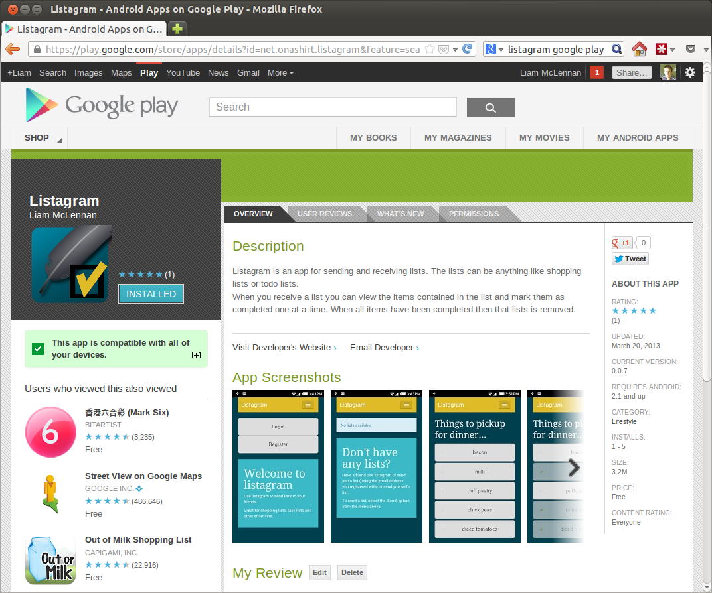

> UPDATE: I have made the [listagram source](https://bitbucket.org/liammclennan/list-a-gram) publically available for anyone who is interested.

If you have a billion dollar company, or very specific needs, then it may make sense to develop native mobile applications for multiple platforms. For everyone else it is hard to argue against the practicality of portable html-based applications. Such has been my uneducated opinion for some time. To prove that multi-platform web apps are a viable option I decided to build one.

The Story So Far
--------

I travel home from work on the train. While making my way home it is not unusual for my wife to send me a list of groceries for me to pickup. I found that an SMS as a shopping list does not provide a good user experience. It is too hard to see the items and to keep track of which items remain. 

Listagram
---------

The app that I built is called [Listagram](https://play.google.com/store/apps/details?id=net.onashirt.listagram&feature=search_result#?t=W251bGwsMSwxLDEsIm5ldC5vbmFzaGlydC5saXN0YWdyYW0iXQ..). It provides two features:

* Send a list of items, to yourself or to someone else
* Receive a list, view the items and complete the items as required



Technical
---------

### Client

I built the app entirely as a standalone web application. It was nice to be able to develop without resorting to testing on a mobile device or emulator. I used chrome and its wonderful developer tools.

The client-side and server-side code is all written as [commonjs modules](http://wiki.commonjs.org/wiki/Modules/1.1) and packaged for client-side use with [browserify](https://github.com/substack/node-browserify). The language I used is [CoffeeScript](http://coffeescript.org/), which browserify takes care of compiling.

For a client-side UI framework I used [stativus](http://stativ.us/). Stativus is a UI statechart very good for treating UI changes as state transition. This is helpful for preventing memory leaks and provided an interesting contract to [backbone](http://backbonejs.org/) - the framework that I have most experience with.

The UI templates are rendered using [underscore's template function](http://underscorejs.org/#template). To precompile the UI templates and merge them into a single file I wrote a node.js module called [underscorec](https://npmjs.org/package/underscorec). Underscorec can read a directory structure of templates and compile it.

Client-side storage is provided by [localStorage](http://diveintohtml5.info/storage.html).

Usage is:

```
underscorec views/ output.js
```

where `views/` is a directory structure containing templates. The templates can then be used be calling a function with a name matching the name of the compiled template:

```
templates[home/index]({name: 'Peter', age: 27})
```

### Server

The server is written as a node.js application. The web framework is [express](http://expressjs.com/) and the data is stored in [couchdb](http://couchdb.apache.org/).

### Server Deployment

The services that drive the app are deployed to a vps via an ssh script and git. I use [forever](https://github.com/nodejitsu/forever) to start the node.js app as a service. 

### Client Deployment

The client is packaged as a multi-platform mobile application using [phonegap](http://phonegap.com/). I used the online service [Phonegap Build](https://build.phonegap.com) to create my app packages for each mobile platform.

Final Thoughts
-------------

The experience turned out to be more work than I anticipated but it did confirm my suspicion that the cross-platform mobile solution is viable for most requirements. 
