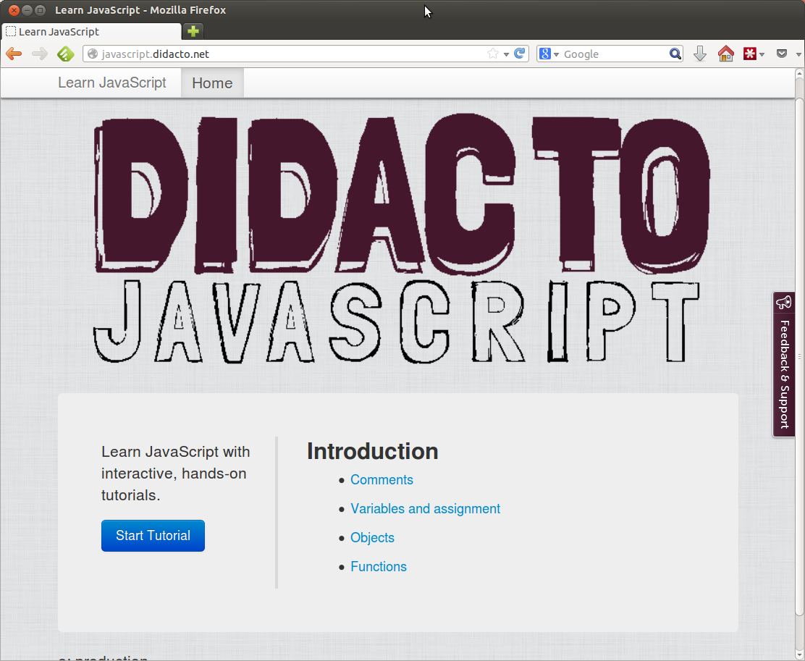

[Didacto: JavaScript](http://javascript.didacto.net/) is a web site that teaches JavaScript using a set of tutorials (currently covering just the basics). What makes didacto unusual and interesting is that the tutorials include questions that can be answered and automatically evaluated. If you get a question wrong didacto can tell you and also tell you why. 

The executable tutorial idea was borrowed from the excellent [School of Haskell](https://www.fpcomplete.com/). In a way it is the natural evolution of my old [JavaScript Koans project](https://github.com/liammclennan/JavaScript-Koans).

I started with JavaScript because the server component of Didacto is written in JavaScript so that was easiest but I would like to extend the same idea to C# and other languages if it seems worthwhile.

<a href="http://javascript.didacto.net/"><a/>
