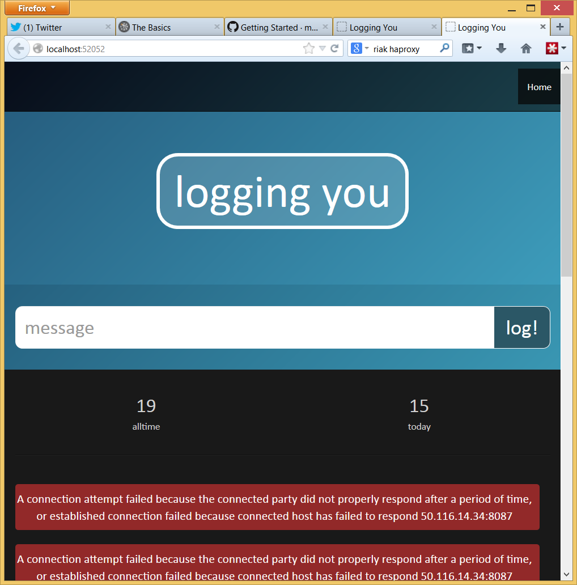

The benefits of [functional programming](http://en.wikipedia.org/wiki/Functional_programming) are [well known](http://www.cs.kent.ac.uk/people/staff/dat/miranda/whyfp90.pdf), and [well documented](http://callvirt.net/blog/post/Why-F-%28TechEd-09-DEV450%29.aspx). The rest of this article will assume that this argument has been digested and accepted.  Given the benefits of functional programming the relatively low adoption can be attributed to general resistance to change, the front-loaded learning curve, a degree of complacency, and uncertainty about how to accomplish common programming tasks with a functional toolset. This article focuses on the latter, particularly in the context of .net consulting projects.

Functional Programming for the .net Programmer
---------------------------------------------

A common fallacy is that we can achieve the benefits of functional programming by applying a functional style within a procedural language. Immutability is essential to functional programming and procedural languages, such as c#, do not encourage or support immutability. Whilst a functional style of c# programming is certainly an improvement we must not pretend that it is a reasonable substitute for a proper functional programming language. For the programmer working with .net tools in the .net ecosystem F# is the obvious prime candidate for a functional programming language. It is the only first-class, functional-first .net language.

Some project managers worry that embracing a functional programming language will cause hiring difficulty. This fallacy possibly occurs because the push for functional programming generally comes from the programmers themselves. Non-programmers associated with software projects have little visibility into the rise and popularity of functional programming. Here in Brisbane the [local functional programming user group](http://www.meetup.com/Brisbane-Functional-Programming-Group/) has 484 members. Each year Brisbane hosts a [well attended conference](http://www.yowconference.com.au/lambdajam/) dedicated to functional programming. The amount of functional programming talent available for hire is underestimated. 

Finally, the notion of sticking to tools that make hiring easier contradicts the 'right tool for the job' directive that we should strive for. If the majority of unemployed programmers were assembler experts would you chose assembler for your next project?

Mixed Solutions
--------------

An important tool when introducing F# to a project is the ability to include F# and other .net languages within the same application. This reduces risk considerably because we retain the ability to fall back to another .net language (usually c#) in the event that F# is deemed to be unsuitable for a particular purpose. The reality is that this is not likely to ever be necessary - still there is value in reducing the perception of risk. 

A solution will be simpler, and more cohesive, if F# is used exclusively, however .net supports mixed solutions by allowing different projects to use different languages, and by supporting interoperability in both directions. 

Interoperability Between F# and C#
---------------------------------

Calling from F# into c# is a simple matter of using c# style syntax. 

    new RiakObjectId("logs", kvp.Key)

Note the use of the new keyword to create an object, paranthesis to delimit method arguments, and commas to separate method arguments. 

Calling from c# into F# is similarly straightforward. F# functions appear in c# as static methods on static classes that map to the F# modules. The following F# and c# code are equivalent:

    open Data
    nowToTodayString DateTime.Now

    Data.nowToTodayString(DateTime.Now)

F# for Web Applications
----------------------

F# is unfortunately not currently treated as a first-class .net language by visual studio. There is no built-in template for creating a web or desktop application with F#. The only supported scenarios are library and command line projects. In the absense of built-in templates the community has provided some excellent templates for a wide variety of scenarios.

The visual studio online project templates include an excellent template called [F# and C# Web Application template](http://visualstudiogallery.msdn.microsoft.com/3d2bf938-fc9e-403c-90b3-8de27dc23095). It creates a minimal c# web project and an auxillary F# library containing as much of the code as possible, including the controllers, view models, and application instance. The only application code required to be implemented within the c# web application project is the views. The case study discussed later is built on this template.

F# for Windows Services
--------------------

Despite there being no built-in template for F# windows services, F# is well suited to this task. The Visual C# Windows Service project actually does very little so it is trivial to manually implement an F# service, as described in the MSDN article [Creating Windows Services in F#](http://msdn.microsoft.com/en-us/library/vstudio/hh297113%28v=vs.100%29.aspx#gff).

Implementing a service only requires a `ServiceBase` implementation and a service `Installer` implementation. 

F# Tooling Support
------------------

F# tooling support is minimal, compared to c# and VB.NET. As mentioned previously there is a shortage of built-in project templates, but this is easily rectified by the online, community contributed templates. Many .net technologies, such as asp.net and WPF, do not explicitly support F#, meaning that the F# programmer has some extra work to do. Also, third party productivity tools, such as ReSharper, typically do not support F#. When our productivity tools become a contributing factor for foundational technology decisions it is time to question, "have we lost control?".

F# Data Access
-------------

Most data access methods assume mutability, which negates some of the benefits of FP. The exceptions are the explicity immutable data stores, such as [Datomic](http://www.datomic.com/) and [Event Store](http://geteventstore.com/) and the http based datastores like [CouchDB](http://couchdb.apache.org/) and [Riak](http://basho.com/riak/). 

The case study included with this article uses Riak for its data store. F# has no direct support for Riak, however, it is trivial to use the [CorrugatedIron](http://corrugatediron.org/) client (written in c#) to communicate with Riak. All of the aforementioned data stores provide an HTTP interface, so a specialized client is not strictly necessary. 

Case Study - Logging You
------------------------

[Logging You](http://loggingyou.azurewebsites.net/) is a bad demonstration of F#'s advantages. It includes none of F#'s core competency (computation) and lots of F#'s weaker areas (interop, GUI programming, transactional data access). Indeed the purpose of this case study is to investigate the feasibility of F# as a standard tool for .net consultants, therefore the important question to answer is, "how well does it handle those weaker areas?".

Logging you is a log dashboard built as an asp.net mvc web application. It's two use cases are:

* display a summary of the currently stored logs. This includes the alltime total count of logs, the count of today's logs, and the list of today's log messages.
* allow the user to enter a new informational log message

These simple requirements forced the development of mvc integration, data queries and mvc model binding. F# handled all of these non-ideal (for a functional programming language) tasks with aplomb. Being a standard asp.net website Logging You is hosted on Azure without any special modifications. The [source](https://bitbucket.org/liammclennan/loggingyou) is available on bitbucket. 

Find Out More
------------

If you are interested in learning more about applied functional programming in .net, here are some helpful resources:

* [FSharp for Fun and Profit](http://fsharpforfunandprofit.com/why-use-fsharp/)
* [The F# Software Foundation](http://fsharp.org/)
* [Try F#](http://www.tryfsharp.org/)
