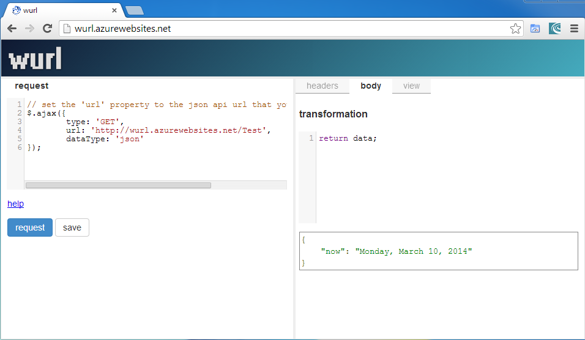
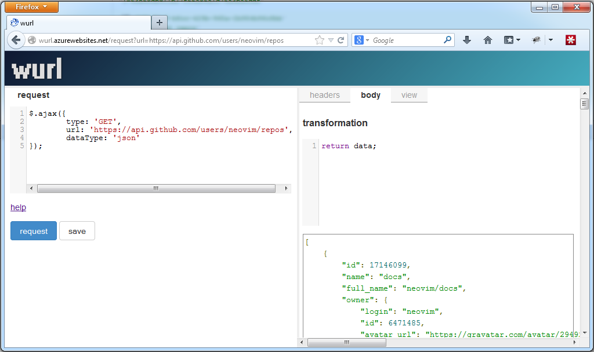

Previously I wrote about [Aristotle](http://withouttheloop.com/articles/2014-02-09-aristotle/), my attempt at a usable http test client in the browser. Over the last two months Aristotle has been renamed [wurl](http://wurl.azurewebsites.net), received a much improved user interface and many new features.

Here is the short list of improvements:

* new fullscreen tabbed layout
* support for endpoints that don't support CORS
* realtime filtering of results
* realtime rendering of views
* save templates
* request a template by url ([http://wurl.azurewebsites.net/request?url=https://api.github.com/users/neovim/repos](http://wurl.azurewebsites.net/request?url=https://api.github.com/users/neovim/repos))

What's Missing
-------------

wurl is optimised for what I need most, which is querying json apis. Some things not yet implemented are:

* support for xml responses
* identifying and linking urls in responses so that an api can be navigated
* more advanced non-cors requests
