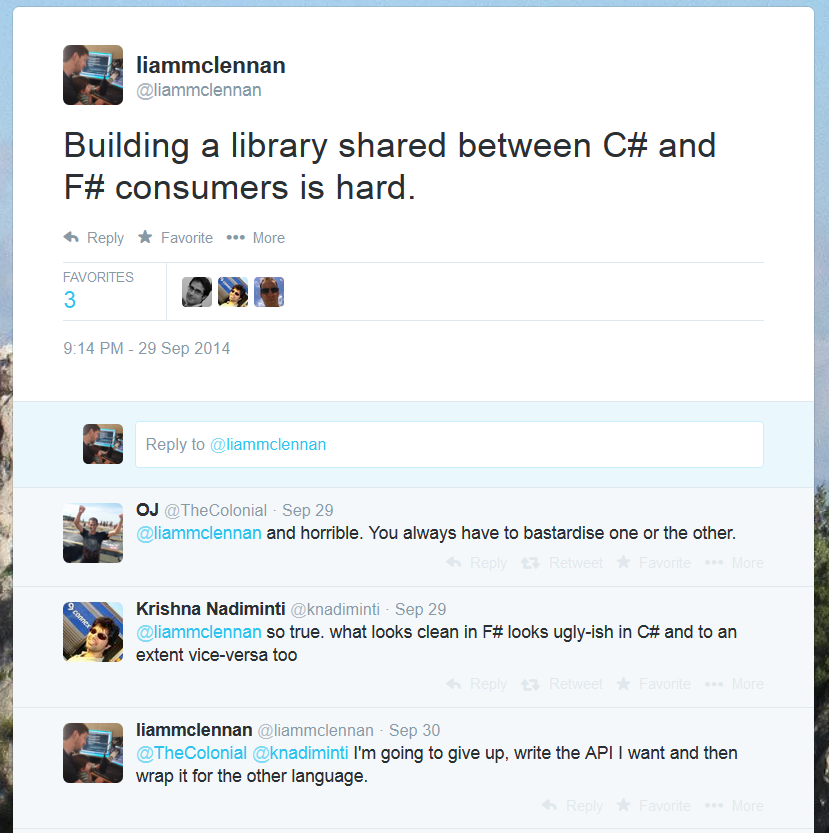

[PostgresDoc](/articles/2014-09-30-postgresql-nosql/) is a simple F# library for working with document data in Postgresql. Recently, I have been experimenting with ways to use it from C#.

Using an F# Library from C#
---------------------------

It is certainly possible to use an F# library from C#, but the syntax can be difficult. To ease the pain I experimented with ways to make the API more C# friendly, and ultimately [gave up](https://twitter.com/liammclennan/status/516546495156203520).

Wrapping an F# Library for C# consumers
----------------

The approach that ultimately worked for me was to create a new C# project that wraps the F# version of PostgresDoc and provides an API that is optimised for C#. The unit of work is represented by a Queue. New operations are added via the `Enqueue` method, and created via static factory methods on the Operation class, like so:

	unitOfWork.Enqueue(Operation.Insert(ernesto._id, ernesto));

The PostgresDocCs C# API
-----------------

Here is a simple example of working with a document from C#:

	public class Person 
    {
        public Guid _id { get; set; }
        public string Name { get; set; }
        public int Age { get; set; }
        public string[] FavouriteThings { get; set; }
    }

	var ernesto = new Person
            {
                _id = Guid.NewGuid(),
                Name = "Ernesto",
                Age = 31,
                FavouriteThings = new[] { "Pistachio Ice Cream", "Postgresql", "F#" }
            };
	var connString = "Server=127.0.0.1;Port=5432;User Id=******;Password=*****;Database=testo;";

	var unitOfWork = new Queue<Operation<Guid>>();
	
	// insert a document
	unitOfWork.Enqueue(Operation.Insert(ernesto._id, ernesto));
	
	// modify a document
	ernesto.Age = 32;
	unitOfWork.Enqueue(Do.Update(ernesto._id, ernesto));
	
	// persist the changes in a transaction
	UnitOfWork.Commit(connString, unitOfWork)

### Querying

	var ernesto = Query<Person>.For(
                connString, 
                "select data from Person where id = :id", 
                new Dictionary<string, object> { {"id", ernesto._id} });
