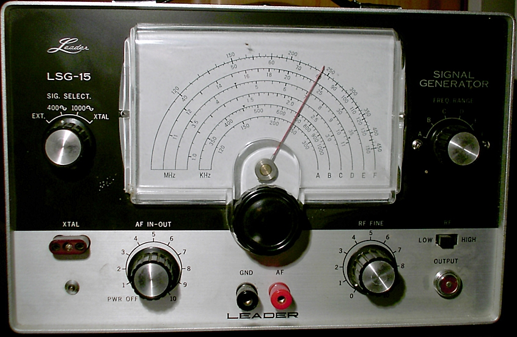
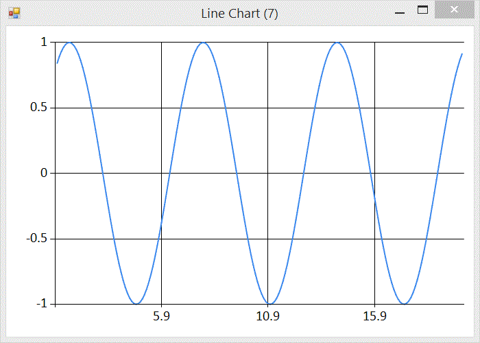

As part of a larger project I have been working on a signal generator. A signal generator is a device (in this case an F# program) that is often used to generate waves at a particular frequency that can be interpreted as sound (by applying to a speaker as a voltage). 

For my project I want to generate pitches and then convert the signal to PCM audio data, wrapped in the windows WAVE file format. PCM format means that the signal is represented as a series of positive or negative values within a certain range. The number of samples per second is called the sample rate (44,100 for CD audio). The range of the values is governed by the bit depth, again I will stick with the CD audio standard 16 bit audio, giving me a range of -32768 to 32767.

Generating Signals
----------

The simplest and purest representation of a particular frequency is given by a sine wave. 

_This graph was generated using FSharp.Charting and the following fsx file_

    #load "../packages/FSharp.Charting.0.90.7/FSharp.Charting.fsx"
    open FSharp.Charting
    let c = seq { for x in [1.0..0.1..20.0] do yield (x, sin x) } |> Chart.Line

Note that the wave has a range from -1 to 1 and a recurring regular frequency. But what is that regular frequency? The F# `sin` function operates on an angle given in radians. Experimenting in the F# repl (fsi) we can find that `sin` of PI radians is 0

    > sin System.Math.PI;;
    val it : float = 1.224606354e-16

Interesting. What about the `sin` of 2 PI radians?

    > sin (2. * System.Math.PI);;
    val it : float = -2.449212708e-16

Those accustomed to working with floating point numbers will recognise that anything x 10^-16 is floating points version of 0. So sin (n * PI) is 0. This tells us, or at least suggests, that the graph crosses the x axis every PI change in x. Now let's look at mid-points between x intercepts:

    > sin (1.5 * System.Math.PI);;
    val it : float = -1.0
    > sin (2.5 * System.Math.PI);;
    val it : float = 1.0
    > sin (3.5 * System.Math.PI);;
    val it : float = -1.0

Half way between PI and 2 x PI the y value is -1. Half way between 2 x PI and 3 x PI the y value is 1. Half way between 3 x PI and 4 x PI the y value is back to -1, so we see that the graph repeats every 2 x PI. 

Now we can start generating PCM data. First we need to list the samples we want to create:

    let requiredSamples = seq { 1.0..(seconds * sampleRate) }

We need `sampleRate` samples for every second. Next we plot those points using the `sin` function, and scale them by the expected range for 16 bit audio.

    let samples = Seq.map 
                    (fun x -> x |> sin |> (*) 32767 |> int16) 
                    requiredSamples

Now we have PCM audio samples that we can pack and send to an audio player for listening pleasure.

Packing PCM data into a WAVE File
--------------------

The [WAVE file format](https://ccrma.stanford.edu/courses/422/projects/WaveFormat/) is a binary format defined as part of Microsoft's RIFF specification. The details of the format are not very interesting. It has some headers that describe the format in use, and details of the audio data, such as sample rate, bit depth and number of channels. To encode 16 bit mono samples at 44,100the following is sufficient:

    let pack (d:int16[]) = 
        let stream = new MemoryStream();
        let writer = new BinaryWriter(stream, System.Text.Encoding.ASCII);
        let dataLength = Array.length d * 2
                    
        // RIFF
        writer.Write(System.Text.Encoding.ASCII.GetBytes("RIFF"))
        writer.Write(Array.length d)
        writer.Write(System.Text.Encoding.ASCII.GetBytes("WAVE"))
                                
        // fmt
        writer.Write(System.Text.Encoding.ASCII.GetBytes("fmt "))
        writer.Write(16)
        writer.Write(1s)        // PCM
        writer.Write(1s)        // mono
        writer.Write(44100)     // sample rate
        writer.Write(44100 * 16 / 8)     // byte rate
        writer.Write(2s)        // bytes per sample
        writer.Write(16s)       // bits per sample

        // data
        writer.Write(System.Text.Encoding.ASCII.GetBytes("data"))
        writer.Write(dataLength)
        let data:byte[] = Array.zeroCreate dataLength
        System.Buffer.BlockCopy(d, 0, data, 0, data.Length)
        writer.Write(data)
        stream
                                                                                            
Tuning
------

So far we have a signal generator that generates audio data following a sine wave, but we have no control of the pitch (frequency) of the sound. We know that the wave repeats every 2 x PI, and we know that we have 44,100 samples per second. What we need is a way to expand and contract the wave horizontally to hit target frequencies. The graph transformation that controls horizontal stretch is achieved by multiplying the argument by a factor prior to applying the original function. ie

    let square x = x * x
    let squareStretched x = (2 * x) * (2 * x)

The frequence of the wave is

    freq = 44100 / period

and the period is 2 x PI. To add a horizontal stretching factor we multiply by some factor.

    freq = 44100 / 2 x PI x factor

solving for the factor

    factor = 44100 / 2 * PI * freq

Now we can update our signal generating function to be tuneable using the inverse of factor

    let frequency = 440.
    let samples = Seq.map 
                    (fun x -> x 
                    |> (*) (2. * System.Math.PI * frequency / 44100.)
                    |> sin 
                    |> (*) 32767 
                    |> int16) 
                    requiredSamples

Now we can tune our data to frequencies. Above I have used 440Hz (concert A). To pack into a WAVE and save to a file

    let write (ms:MemoryStream) =
        use fs = new FileStream(Path.Combine(__SOURCE_DIRECTORY__,"test.wav"), FileMode.Create)
        ms.WriteTo(fs)

    samples |> pack |> write

Admiring the Results
------------------

What is the result of all that effort? [A few seconds of concert pitch](test.wav).

