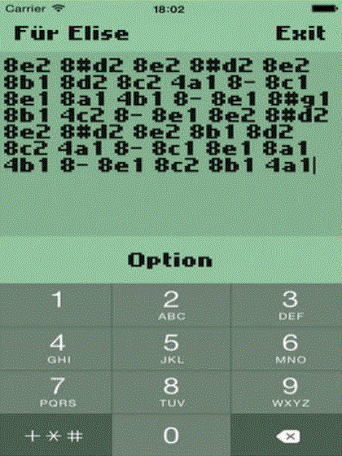

 

The classic Nokia 3310, and similar Nokia phones featured a capability to define custom ringtones using a tool called 'Composer'.

Parser uses a text based format to define the sequence of tones that makes up the ringtone. A tone is typically specified in the form:

<blockquote>8e2</blockquote>

Where the `8` indicates that the tone should last for eighth of a bar (half of a beat), the `e` is the musical note describing the pitch of the tone and the `2` indicates the octave that note comes from (valid options are 1, 2 and 3). 

I want to be able to read the string that defines a composer tune and interpret it in a precise way that can be used for computations (like playing the tune). The full syntax, as a regular expression, is something like:

    (\d+\.?#?[abcdefg][123])|(\d+\.?\-) 

A tune is specified by a sequence of tokens, separated by spaces. Each token is either a tone or a rest. A rest is specified by a duration and an optional extension followed by a hyphen (e.g. `4.-`). A tone is specified by a duration and an optional extension followed by a note (which may be preceded by a # to indicate sharp), followed by an octave (e.g. `16.#f3`).

The Nokia Composer syntax is simple enough that I could parse it with string functions or regular expressions, but I thought it might be fun to do it properly with a [parser combinator](http://en.wikipedia.org/wiki/Parser_combinator) library. A parser is a function that accepts a string and returns some structure. A parser combinator is a higher-order function that combines several parsers into a single parser. F# has an excellent parser combinator library called [FParsec](http://www.quanttec.com/fparsec/). In FParsec a parser that reads a float looks like:

    pfloat "3.14"
    // => Success(3.14,...)

A combinator that parses two floats separated by a space

    "3.14 2.71828" |> pfloat .>> pstring " " >>. pfloat 

The strategy with parser combinators is to build parsers for the smallest units of syntax, then combine them into larger and larger pieces until you have a parser for the entire thing. 

If you don't have the good fortune to be using F# don't worry, there is a [parser combinator library for C#](https://github.com/sprache/Sprache) too. 

Parsing the Nokia Composer Syntax
------------------------

### Parsing the Duration

Before we can parse we need types to parse too. The types that will represent the duration of the tone or rest are:

    type NoteLength = Half | Quarter | Eighth | Sixteenth | Thirtyseconth 
    type Length = { duration: NoteLength; extended: bool }

A length type has a duration and an extended bool. Durations followed by a `.` are extended by half. The parser for the duration part is:

    let pnotelength = 
        (stringReturn "2" Half) <|> 
        (stringReturn "4" Quarter) <|> 
        (stringReturn "8" Eighth) <|> 
        (stringReturn "16" Sixteenth) <|> 
        (stringReturn "32" Thirtyseconth)

This simply codifies that the duration can be 2,4,8,16 or 32. The extended parser is:

    let extendedParser = (stringReturn "." true) <|> (stringReturn "" false)

These two parsers are combined into a single duration parser that produces a `Length`.

    let plength = pipe2 
                    pnotelength            
                    extendedParser 
                    (fun t e -> {duration = t; extended = e})

### Parsing the Pitch

The syntax that describes the pitch is

    (#?[acdfg])|([be])

That is a,c,d,f and g may be preceded by a `#` to indicate a sharp (a semitone higher) while b and e may not. 

The parser for the optional `#` symbol is:

    let psharp = (stringReturn "#" true) <|> (stringReturn "" false)

i.e. parse a `#` as `true` or its absense as `false`.

The `<|>` combinator combines two combinators by giving the result of the first one, unless it fails having consumed no input, in which case it gives the result of the second. The restriction that the second parser is only tried if the first does not consume any input is very important and described in detail in [the FParsec documentation](http://www.quanttec.com/fparsec/users-guide/parsing-alternatives.html).

Next we have a parser for notes that may be sharps. The target type for this parser is:

    type Note = A | ASharp | B | C | CSharp | D | DSharp | E | F | FSharp | G | GSharp

and the parser:

    let psharpnote = pipe2 
                        psharp 
                        (anyOf "acdfg") 
                        (fun isSharp note -> match (isSharp, note) with
                            | (false, 'a') -> A
                            | (true, 'a') -> ASharp                    
                            | (false, 'c') -> C
                            | (true, 'c') -> CSharp
                            | (false, 'd') -> D
                            | (true, 'd') -> DSharp
                            | (false, 'f') -> F
                            | (true, 'f') -> FSharp
                            | (false, 'g') -> G
                            | (true, 'g') -> GSharp
                            | (_,unknown) -> 
                                sprintf "Unknown note %c" unknown 
                                |> failwith)

`pipe2` sequences parsers, meaning that `psharpnote` is a parser that first parses an optional `#` (via `psharp`) and then parses one of the characters a,c,d,f or g. The results are then mapped to the `Note` type. The above parser cannot produce B or E results, since these are not sharpable notes. A further parser is required:

    let pnotsharpablenote = anyOf "be" |>> (function 
                            | 'b' -> B
                            | 'e' -> E
                            | unknown -> 
                                sprintf "Unknown note %c" unknown 
                                |> failwith)

Note that both `psharpnote` and `pnotsharpablenote` include a pattern match that throws an exception. The compiler requires the pattern match to be exhaustive, however by inspection we can see that the 'unknown' case can never actually occur. This is a case where the type system is not sufficiently powerful to capture the fact that the value can only be a 'b' or 'e' character.

The last remaining hurdle for our `Note` parser is to deal with the alternatives:

    let pnote = pnotsharpablenote <|> psharpnote

Now we have one parser, `pnote` that can parse any possible note. 

Finally, we need to parse the octave to the following type:

    type Octave = One | Two | Three

This can be done with a simple character parser:

    let poctave = anyOf "123" |>> (function
                    | '1' -> One
                    | '2' -> Two
                    | '3' -> Three
                    | unknown -> sprintf "Unknown octave %c" unknown |> failwith)

The `|>>` combinator sends the parsed value of its first argument to its second argument, allowing us to map the char 1,2 or 3 to values of type `Octave`.

### Putting Things Together

If `Sound` is defined as a rest or a Tone:

    type ToneRecord = { note: Note; octave: Octave }
    type Sound = Rest | Tone of ToneRecord

Then we can parse a `Tone` like so:

    let ptone = pipe2 pnote poctave (fun n o -> Tone {note = n; octave = o})

and a rest:

    let prest = stringReturn "-" Rest

Finally, a `Token` is a duration + (tone || rest):

    type Token = { length: Length; sound: Sound }

and is parsed thus:

    let ptoken = pipe2 
                    plength 
                    (prest <|> ptone) 
                    (fun l t -> {length = l; sound = t})

That is everything required to parse a Nokia composer token, which defines a rest or a note. 

### Parsing Tunes

Parsing a tune is a simple matter of applying the `ptoken` parser repeatedly until the end of the string. Naturally, there is a combinator for that. `sepBy` takes two parsers: the first to parse items and a second to parse the separators between items. For the space separated Nokia Composer syntax we can use:

    let pscore = sepBy ptoken (pstring " ")

With this parser we can now parse 'I Don't Wanna Miss a Thing' by Aerosmith:

    pscore "2- 16a1 16- 16a1 16- 8a1 16- 4a2 16g2 16- 2g2 16- 4- 8- 16g2 16- 16g2 16- 16g2 8g2 16- 4c2 16#a1 16- 4a2 8g2 4f2 4g2 8d2 8f2 16- 16f2 16- 16c2 8c2 16- 4a2 8g2 16f2 16- 8f2 16- 16c2 16- 4g2 4f2"
