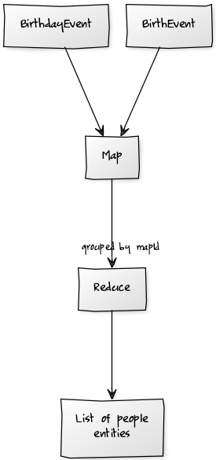

Summary
----

CouchDB, with its indexed views, has some promising properties for an "event sourcing"* system.

Because views are a function of the documents in the database, and they are indexed, it seems like we can have the best of both worlds, where the authoritative data store is the historical events that have occurred, but at the same time we have an indexed projection of the events that is guaranteed to be up to date (prior to a read).

Disclaimer
---

I have never built an event sourced system. I expect I am doing everything wrong. I'm interested in hearing reasoned commentary. I am less interested in hearing dogma.

Read Side
----

The following is my current list of 'person' entities.

<table id="documents" class="listing" cellspacing="0">
        <caption>Documents</caption>
        <thead>
          <tr>
            <th class="key">
              <label class="" id="grouplevel">
                Grouping: <select>
                  <option value="0">none</option>
                  <option value="1">level 1</option>
                  <option value="2">level 2</option>
                  <option value="3">level 3</option>
                  <option value="4">level 4</option>
                  <option value="5">level 5</option>
                  <option value="6">level 6</option>
                  <option value="7">level 7</option>
                  <option value="8">level 8</option>
                  <option value="9">level 9</option>
                  <option value="100" selected="">exact</option>
                </select>
              </label>
              <span>Key</span>
            </th>
            <th class="value">
              <label id="reduce"><input autocomplete="off" checked="" type="checkbox">&nbsp;Reduce</label>
              Value
            </th>
          </tr>
        </thead>
        <tbody class="content"><tr><td class="key"><strong>["abigailmclennan"]</strong></td><td class="value"><div><code class="object">{<code class="key">_id</code>: <code class="string">"abigailmclennan"</code>, <code class="key">name</code>: <code class="string">"Abigail"</code>, <code class="key">age</code>: <code class="number">1</code>}</code></div></td></tr><tr class="odd"><td class="key"><strong>["foobarlalala"]</strong></td><td class="value"><div><code class="object">{<code class="key">_id</code>: <code class="string">"foobarlalala"</code>, <code class="key">name</code>: <code class="string">"Noah"</code>, <code class="key">age</code>: <code class="number">2</code>}</code></div></td></tr></tbody>
        <tbody class="footer">
          <tr class="odd">
            <td colspan="4">
              <div id="paging">
                <a class="prev">← Previous Page</a> |
                <label>Rows per page: <select id="perpage">
                  <option selected="">10</option>
                  <option>25</option>
                  <option>50</option>
                  <option>100</option>
                </select></label> |
                <a class="next">Next Page →</a>
              </div>
              <span>Showing 1-2 of unknown rows</span>
            </td>
          </tr>
        </tbody>
      </table>

Write Side
---

But they are not stored in my database, instead the database stores the *events* that caused those entities to have the values they do.

In this example I have two different kinds of events:

* BirthEvent - indicating that a person was born
* BirthdayEvent - indicating that a person had a birthday

From these events the 'person' entities are calculated. To make this work in couchdb I have used the following rules:

* each event has a 'mapId' property that is the identifier of the related entity
* each type of entity has a map/reduce view. The map function produces each event with its mapId as the key. The reduce function is then passed the set of events that determine the value of an entity. The reduce function processes the events and returns the current state of the entity.
* each event has a **timestamp** property. To hydrate state from events we need to know the order in which the events occurred.

In my database I have two **BirthEvents**, and three **BirthdayEvents**.

The process is something like this:



CouchDB View Code
----

The map function simply keys the entities by their mapId:

```{javascript}
function(doc) {  
  if (doc.mapId) {
    emit([doc.mapId], doc);
  }
}
```

This means that the **values** object within the reduce function is the set of events that produce a single person entity.

The reduce function then orders the events, by **timestamp**, and processes them to calculate the current state of the entity:

```{javascript}
function(keys, values) {
  values.sort(function (f,s) {
    if (f.timestamp > s.timestamp) return 1;
    if (f.timestamp == s.timestamp) return 0;
    return -1;
  });
  var acc = values.reduce(function (p,c,i) {
    if (c.type=='BirthEvent') {
      return {
        _id:c.mapId,
        name:c.name,
        age:0
      };
    }
    if (c.type == 'BirthdayEvent') {
      p.age +=1;
      return p;
    }
    return c;
  },{});
  return acc;
}
```

Result
---

There are some concerns remaining.

Each event must somehow map to the entity it produces. A more complicated scheme could be used (to allow an event to affect the state of > 1 entity) but I'm still not sure if this is ideal.

The reduce function may (or may not) have performance problems. I have not found a way to store the sorted events in the index, so they are re-sorted when the reduce function runs.

The reduce function is a function from a set of events to the entity those events produce. This could become complicated.

Entity state is a function of the events that produce the entity, meaning that all entity data must be derivable from the events. I'm not sure if this is good or bad.

Similar Systems
----

One could do the same thing with Sql Server materialized views (except the processing code would have to be written in T-SQL) or with a streaming system (Kafka/Samza/Storm/etc).

<span>*</span> not certain what this is.
