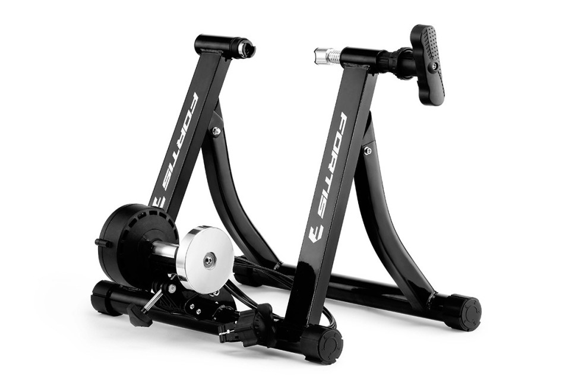

I'm reviewing the [fortis magnetic indoor bicycle trainer](https://www.kogan.com/au/buy/fortis-magnetic-indoor-bicycle-trainer/) because no one else has. I have only used mine twice so I can't comment on longevity and it is my first turbo trainer so I don't know how it compares to others. Here is what I do know.

Assembly is straightforward - simply mount the resistance thingo on the frame, and swap the rear quick release skewer on your bike for the supplied one that fits the frame mounts. I'm not sure if this skewer is suitable for regular riding, and I'm not game to find out at 70km/h down a hill, so I swap my regular skewer back in before hitting the road. It is simple to mount the bike but important that the surface be perfectly level. A tightening bolt is then used to secure the roller against your bike's back wheel. Resistance is controlled via a handlebar mounted dial.

The good
========

The device seems reasonably sturdy and works as advertised. I get exercise. Assembly was simple.

The less good
=============

There are 6 resistance levels and none of them are very difficult. I think a good cyclist may struggle to struggle. The resistance has a lot of inertia, so it is difficult at first but becomes easier with momentum. It feels like you are spinning up a flywheel. Very much the opposite of actual cycling.
