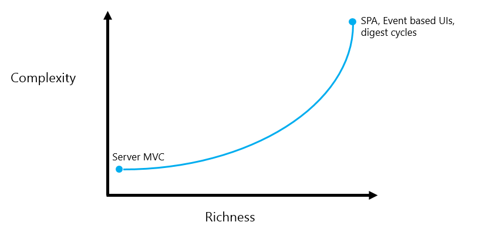
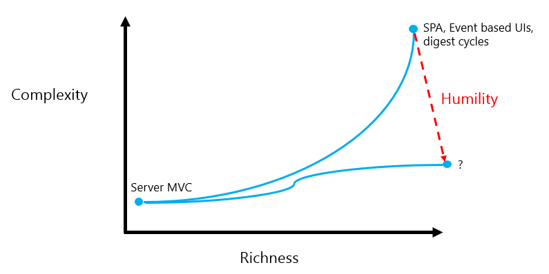

I confess to a nostalgia for the ol' days of web development, when applications ran on the server, where they belong. To ensure that I am on the right side of history I acknowledge that JavaScript UIs are now defacto standard and therefore turn my attention to making them nicer to build. 

Where are we now?
==============

The image above visualizes the shift to richer user interfaces, and the added technology burden that we have accepted in exchange. I propose that we have given to much ground on complexity, and done so unnecessarily. 

The way forward requires a liberal dose of *humility*. We must acknowledge our human limitations and compensate by aggresively pursuing simple solutions. If you don't believe me [listen to Dijkstra](https://www.cs.utexas.edu/~EWD/transcriptions/EWD03xx/EWD340.html):

>  "We shall do a much better programming job, provided that we approach the task with a full appreciation of its tremendous difficulty, provided that we stick to modest and elegant programming languages, provided that we respect the intrinsic limitations of the human mind and approach the task as Very Humble Programmers."

The Humble Programmer
=====================

The humble programmer recognizes that [simple is more important than easy](http://www.infoq.com/presentations/Simple-Made-Easy), and more important than feeding our egos.

 
*The Humble Programmer is not pleased*

Poor Richard's Web Architecture of the Future
=============================================

From the tar pit of web development tools a concensus is slowly emerging of what a simple web application design of the future might be. This design, sometimes called MVI, consists of three components: a model, a view and intents.

The Model
-------

The model is a single data structure containing the entire user interface state for the application. This must include **everything** required to describe the user interface, including things like highlighted controls, and scroll position. 

The View
--------

Given an exhaustive model as described above the *view* can be reduced to a simple function, from the model to a user interface. 

Intents
------

Intents, sometimes called actions, are simple values that represent things that the user wants to do. Typically, intents are generated by events, e.g. a button click event may produce a 'user wants to add an item to a list' intent. Intents are then processed as updates to the model. When the model changes the view is regenerated. 

MVI from First Principles
=======================

A good way to understand something is to build one, so let us create an MVI application from scratch. 

The application state is a random number (between 0 and 10). The view renders that number in a heading. Clicking on the heading indicates that the user intends to see the square of the number. The 'square' intent is processed by squaring the number in the application state. Because the application state has changed the view is re-rendered.

<iframe width="100%" height="300" src="//jsfiddle.net/b6gosd2d/embedded/result,js" allowfullscreen="allowfullscreen" frameborder="0"></iframe>

More Info
=========

The [Elm Architecture Tutorial](https://github.com/evancz/elm-architecture-tutorial/) is a good read, describing many of the same ideas mentioned here. 

[Cycle.js](http://cycle.js.org/) is another implementation worth exploring. To my knowledge it is the source of the MVI terminology. 

[Redux](https://github.com/rackt/redux) is a "state container for JavaScript apps", meaning it holds the state object and controls the application of intents/actions to it. [React](http://facebook.github.io/react/) provides an implementation of the view component. Redux is designed to work with React and together they complete the MVI design. 

Dijkstra's Final Thoughts
==============

> "The competent programmer is fully aware of the strictly limited size of his own skull; therefore he approaches the programming task in full humility"

