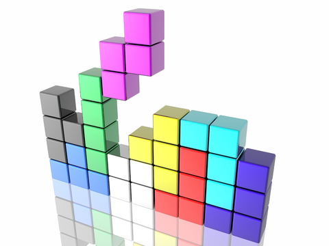
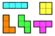

I cannot think of a game more classic than tetris. When I was a kid it was the staple diet of gameboy wielding preteens. Therefore, I decided to reimplement tetris using javascript, [React](https://facebook.github.io/react/) and [Redux](http://redux.js.org/).

The Cast
=======

### JavaScript (ES2015)

At first I started with TypeScript, but I gave up getting it to work with all the other tooling (type definitions, webpack, React etc) and switched to ES2015. ES2015 is not widely supported so I must compile it to ES5. Since I'm using React (with JSX) I'm obliged to have a compile step anyway.

### React

React is a UI library that knows how to keep a web UI in sync with a model object, and how to dispatch events.

### Redux

Redux is a simple library that puts some structure around UI state and manages the mutation of that state.

### Babel

[Babel](https://babeljs.io/) is the defacto standard tool for ES2015 -> ES5 compilations.

### Browserify

One of the ES2015 features is modules, but to take advantage of ES2015 modules, to include other modules from NPM and to improve the network efficiency of the application [Broswerify](http://browserify.org/) converts the modules into something that works in the browser and smooshes everything into a single file.

### Mocha

[Mocha](https://mochajs.org/) is a node-based JavaScript testing tool. It provides a library for logically organising tests and a runner for running the tests and reporting the results.

### Gulp

I use [gulp](http://gulpjs.com/) for my build script. It coordinates all the other tools and provides file system watching.

### What I Hate About All This

The number of fiddly little tools required to work with JavaScript at the moment annoys me. Each in isolation I understand their purpose but considering the ecosystem as a whole it is obviously an appalling waste of time having to deal with all this bits. I'm sure it will settle down with time. Can't wait.

The most pernicious issue is not the quantity of tools required, but the tight coupling between them. Browserify requires a plugin (babelify) to connect it to babel. Mocha requires a plugin (babel-register) to connect it to babel. If I wasn't so lazy as to have gulp execute shell scripts then I would require gulp plugins specific to mocha, browserify and possible babel.

Step 1 - Basic tooling
======================

You may, if you wish, follow along with my [git commits](https://github.com/liammclennan/tetris). This step is commit [dffea31bfee670f4644eaf8d0586a81f576fd548](https://github.com/liammclennan/tetris/commit/dffea31bfee670f4644eaf8d0586a81f576fd548).

To get to this state:

    $ git clone https://github.com/liammclennan/tetris.git
    $ git checkout dffea31bfee670f4644eaf8d0586a81f576fd548

My application starts with a simple, empty, web page:

```
<!DOCTYPE html>
<html>
  <head>
    <link rel="stylesheet" type="text/css" href="style.css">
  </head>
  <body>
    <div id="container">
    <!-- This element's contents will be replaced with your component. -->
    </div>
    <script src="bundle.js"></script>
  </body>
</html>
```

Note that the webpage includes just two files: style.css and bundle.js. The entire application, including all of my javascript and all required libraries, is bundled into bundle.js by browserify. I know you are wondering how, so let's inspect package.json:

```
{
  "name": "tetris",
  "version": "1.0.0",
  "description": "",
  "main": "index.js",
  "scripts": {
    "build": "browserify -t [ babelify --presets [ react ] ] app.js -o bundle.js",
    "test": "echo \"Error: no test specified\" && exit 1"
  },
  "author": "",
  "license": "ISC",
  "dependencies": {
    "babel-preset-react": "^6.3.13",
    "babelify": "^7.2.0",
    "react": "^0.14.3",
    "react-dom": "^0.14.3"
  },
  "devDependencies": {
    "babel-preset-es2015": "^6.3.13",
    "babelify": "^7.2.0"
  }
}
```

Package.json is the metadata file for my NPM package. It includes a list of dependencies and the optional ability to execute some scripts. I have defined a `build` script as:

    browserify -t [ babelify --presets [ react ] ] app.js -o bundle.js

This [tells browserify](https://github.com/substack/node-browserify#usage) to *transform* the input via babelify, and when delegating to babel to use the *react* preset. `app.js` is the root of my application. Browserify will start their and spider through all the included modules. `-o bundle.js` sets the output file. To execute this build script:

    npm run build

Step 2 - A Little Bit of Tetris
=====

The game tetris involves the placement of [tetrominos](https://en.wikipedia.org/wiki/Tetromino).
> A tetromino is a geometric shape composed of four squares, connected orthogonally.

How many tetrominos can you think of? Well there are 5 (I, O, Z, T, L).



React uses components to organise UI elements. The fundamental requirement for a component is that it must have a `render` method that defines how a model object is converted into UI. To assemble Tetrominos we can start by defining a component for a single square (in app.js):

```
var Square = React.createClass({
    render: function() {
    		var s = {
        	left: (this.props.col-1) * 25 + 'px',
          top: (this.props.row-1) * 25 + 'px'
        };
        return <div className="square" style={s}></div>;
    }
});
```

This component converts a simple model of the form `{col,row}` into a div with the class `square` positioned absolutely according to the `row` and `col` values. With this low-level component we can assemble higher level components for the different tetrominos:

```
var OShape = React.createClass({
	render: function () {
  	return <div>
    	<Square row={this.props.row} col={this.props.col} />
    	<Square row={this.props.row} col={this.props.col+1} />
      <Square row={this.props.row+1} col={this.props.col} />
  		<Square row={this.props.row+1} col={this.props.col+1} />
    </div>;
  }
});

var LShape = React.createClass({
	render: function () {
  	return <div>
    	<Square row={this.props.row} col={this.props.col} />
  		<Square row={this.props.row+1} col={this.props.col} />
      <Square row={this.props.row+2} col={this.props.col} />
  		<Square row={this.props.row+3} col={this.props.col} />
    </div>;
  }
});

var SShape = React.createClass({
	render: function () {
  	return <div>
    	<Square row={this.props.row} col={this.props.col+1} />
  		<Square row={this.props.row} col={this.props.col+2} />
      <Square row={this.props.row+1} col={this.props.col} />
  		<Square row={this.props.row+1} col={this.props.col+1} />
    </div>;
  }
});
```

We can then use React to render some tetrominos into the HTML page we defined earlier:

```
ReactDOM.render(
<div>
	<OShape row={1} col={1} />
  <LShape row={1} col={4} />
  <SShape row={1} col={6} />
</div>,
    document.getElementById('container')
);
```

And with that we have the start of the rendering portion of our tetris game! We have done some ES2015 development with modern tooling, and a little bit of React. Redux will enter the picture in a future post.

If you are following along you can build this using:

    npm install
    npm run build

Then open `index.html` in your browser.
