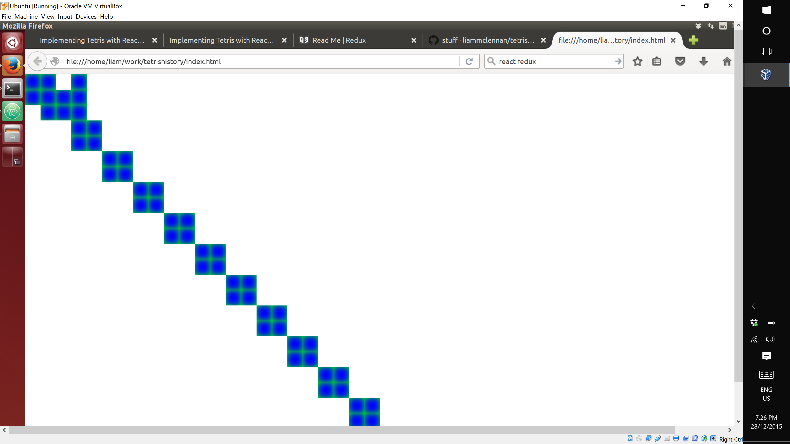

In the previous article we began implementing tetris with React and Redux and got as far rendering the tetris shapes (called tetrominos).

In this addition we will add some animation and introduce Redux for managing UI state.

To follow along with this article checkout the commit [9f2c69](https://github.com/liammclennan/tetris/commit/9f2c695d4e766d03d9280f086dd5429520cd03e3).

```
$ git clone https://github.com/liammclennan/tetris.git
$ git checkout 9f2c69
```

Introducing Redux
=========

React provides two features:

1. It generates a UI from a model and maintains the synchronization.
1. It provides an eventing system for detecting and handling UI events.

By itself then, React is not a sufficient basis for a user interface. Facebook filled the gap with Flux. Flux has the right idea (unidirectional data flow) but over-complicates it with actions, dispatchers and stores. It may be a good design for Facebook, but it is not a good generalized solution for web development.

[Redux](http://redux.js.org/) is a simpler library that started with the ideas of Flux and then left them all out. It provides management of UI state, and the ways in which that state is modified. Here is how it works.

* React events are translated to *actions*. Actions are application level values indicating the users intent, e.g. **add todo item** or **remove calendar entry**. Actions often have associated data, so an actual action might be `{type:'ADD_TODO_ITEM', title:'Buy some milk'}`. There are no rules about the format of actions.
* Redux is configured with functions called *reducers* that apply actions to the current state, and produce an updated state.
* Redux notifies React that the UI state has changed and the UI should be updated.

To add Redux we install two new npm packages:

    npm install --save redux react-redux

Then in `app.js` we create a redux reducer function that knows how to apply actions to the UI state. This is often a switch statement that branches on the type of the action. If you wanted you could instead put the logic in the action and delegate to it.

```
function reducer(state = [new Model.O(1,1), new Model.L(1,4)], action) {
  switch (action.type) {
    case 'TICK':
      state.push(new Model.O(action.data*2,action.data*2));
      return state;
    default: return state;
  }
  return state;
}
```

The parameters to the function are the existing state and an action. We use the ES2015 default parameter feature to initialize the state to an array containing two tetrominos. Then we switch on the type of the action. If the action is a *TICK* then we append a new *O* tetromino to the state. The value returned from a reducer is the new state.

With a fresh reducer function we can now create a redux store to wrap the UI state:

    let store = createStore(reducer);

and register with react to re-render when the state changes:

```
store.subscribe(() => {
  ReactDOM.render(
  <div>
    {store.getState().map(c => <Components.ShapeView shape={c} />)}
  </div>,
      document.getElementById('container')
  );
});
```

Note that the state is extracted from the store by means of the `getState()` method.

Adding Some Animation
====================

Tetris is a 2-dimensional animated game. We need some way to make the pieces move. I like to work in small increments instead of trying to jump immediately to the final solution, so I will be happy with any sort of regular UI change. The simplest thing I can think of is to generate ticks on a timer, and include an increasing value as data.

```
var counter = 1;
setInterval(() => store.dispatch({ type: 'TICK', data: counter++ }),1000);
```

Remember that `store` is our redux wrapper around application state. The `dispatch` method is how we publish an action. 

This combined with our reducer means that every second a square tetromino will be added to the board diagonally to the lower right of the previous piece. The result is something like:



Next Time...
========

The next installment of this series will add falling, rotation and testing.
