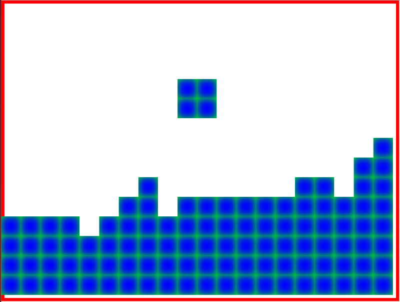

In the previous article we refactored the domain model, simplified the React rendering, and added some JavaScript unit tests.

In this addition we work on collision detection and add event handling for rotation and lateral movement.

To follow along with this article checkout the commit [ce0c31](https://github.com/liammclennan/tetris/commit/ce0c318f9d85ff7cf4edd05cc255395da0bd7294).

```
$ git clone https://github.com/liammclennan/tetris.git
$ git checkout ce0c31
$ npm install
$ npm run away
```

Adding Event Handlers
=======================

Normally in a React application the events come out of the DOM, and therefore come via the React eventing system. For tetris the relevant events are not DOM events but keyboard events. To work with keyboard events we will use the [mousetrap](https://craig.is/killing/mice) library.

```
$ npm install --save mousetrap
```

When the application starts we register some keyboard listeners for the relevant keys:

```
import * as Mousetrap from 'mousetrap';

Mousetrap.bind('space', ()=> store.dispatch({type:'ROTATE'}));
Mousetrap.bind('left', ()=> store.dispatch({type:'LEFT'}));
Mousetrap.bind('right', ()=> store.dispatch({type:'RIGHT'}));
```

With that in place the **space**, **left**, and **right** keys will dispatch corresponding actions to Redux. Therefore, we need to update our Redux reducer function to correctly process these new actions.

```
function reducer(state = new Model.Game(), action) {
  switch (action.type) {
      case 'TICK':
        const revedState = state.tick();
        setTimeout(() => store.dispatch({ type: 'TICK' }),500);
        return revedState;
      case 'ROTATE':
        return state.rotate();
      case 'LEFT':
        return state.left();
      case 'RIGHT':
        return state.right();
      default: return state;
  }
}
```

The `TICK` case has also changed slightly. Previously I used `setInterval()` to trigger a tick on a time interval. The disadvantage of `setInterval()` is that it does not allow the debugger to stop the game. If we stop on a breakpoint to do some debugging `setInterval()` carries on triggering ticks every 500ms. The solution is to process a tick and then use `setTimeout()` to queue the next tick. This way if execution stops on a breakpoint we won't get the next tick until we resume execution.

The `ROTATE`, `LEFT` and `RIGHT` actions are handled by delegating to corresponding methods on the game object. Keeping the heavy lifting out of the reducer function makes it easier to understand and makes the application easier to test.

Implementing Rotation
======

The `Piece` type is aware of its possible rotations (N,E,S,W) and is capable of producing the correct set of points given any of those rotations. Therefore, for the game to rotate the current piece it merely needs to update the piece's `rotation` property. This is done be delegating to the `Piece` object, so the `Game`'s `rotate()` method is just:

    rotate() {
      this.fallingPiece.rotate();
      return this;
    }

Note that rotate must return the game object so that the reducer function can then return it as the updated Redux state.

The `rotate()` method of `Piece` then does the work of calculating what the 'next' rotation is (i.e. if the current rotation is 'N' then 'next' rotation will be 'E').

```
rotate() {
    const rotations = Piece.rotations();
    this.rotation = rotations[(rotations.indexOf(this.rotation)+1) % 4];
},
static rotations() {
    return ['N','E','S','W'];
}
```

Implementing Lateral Movement
=======

As this is Tetris, the player may move the piece from side to side. Like rotation the `Game`'s `left()` and `right()` methods simply delegate to `left()` and `right()` methods on the `Piece`.

A `Piece` is a `Shape` plus a rotation plus an offset. When moving laterally the shape stays the same and the rotation stays the same. Only the offset has to change. A left move requires decreasing the column of the offset by one and a right move requires increasing the column of the offset by one, hence the `left()` and `right()` methods of `Piece` are:

```
left() {
  this.offset = new Point(this.offset.row, this.offset.col-1);
}
right() {
  this.offset = new Point(this.offset.row, this.offset.col+1);
}
```

Preventing Boundary Violations and Collisions
========

Our rotation and lateral movement, as implemented, is entirely unconstrained. The player is able to move the pieces outside the boundary of the game, and also to move pieces over the top of rubble. Preventing these violations is non-trivial, especially for rotations. How do you know if a rotation will cause the piece to go out of bounds or to overlap with some rubble? The easier way is to allow the operation to occur, then check for boundary violations and collisions, and if a problem is found apply a compensating action that reverses the original action.

If a left movement causes the piece to go out of bounds apply a right movement to compensate. If a rotation causes the piece to overlap some rubble apply a rotation in the opposite direction to compensate. Because React separates the calculation of the UI state from the rendering, all of this happens without causing any change to the DOM. The user does not see the action and its compensation. This strategy is implemented in the `Game`'s `transactionDo` method:

```
transactionDo(thing, compensation) {
  thing();
  if (this.fallingPieceIsOutOfBounds() || this.fallingPieceOverlapsRubble()) {
    compensation();
  }
}
```

The argument `thing` is the operation we are attempting. `compensation` is the compensating action to apply in the event that `thing` puts the game into an invalid state. An invalid state is defined as a point out of bounds or a point overlapping rubble. The detection is accomplished with the following two simple methods of the `Game` type:

```
fallingPieceIsOutOfBounds() {
  return this.fallingPiece.minCol() < 1 ||
    this.fallingPiece.maxCol() > this.cols ||
    this.fallingPiece.maxRow() > this.rows;
}
fallingPieceOverlapsRubble() {
  return this.fallingPiece.points().some(p => this.rubble.some(r => r.sameAs(p)));
}
```

The `rotate`, `left` and `right` methods on `Game` can then use `transactionDo`:

```
rotate() {
  this.transactionDo(
    ()=>this.fallingPiece.rotate(),
    ()=> this.fallingPiece.unRotate());
  return this;
}
left() {
  this.transactionDo(
    ()=>this.fallingPiece.left(),
    ()=> this.fallingPiece.right());
  return this;
}
right() {
  this.transactionDo(
    ()=>this.fallingPiece.right(),
    ()=> this.fallingPiece.left());
  return this;
}
```

`unRotate` is simply the inverse of `rotate`:

    unRotate() {
      this.rotation = Piece.rotations()[(Piece.rotations().indexOf(this.rotation)-1) % 4];
    }

Improving the Development Workflow
=============

Development is more efficient if we can see the changes to our application without having to save changes, run the build, and refresh the browser. We can automate the rebuilding process using a filesystem watcher. For this project we will use [gulp](http://gulpjs.com/) to orchestrate this process.

    npm install --save gulp gulp-shell

Gulp is configured by writing a build script in a file **gulpfile.js**. To accomplish our goal this can be as simple as:

```
var gulp = require('gulp');
var shell = require('gulp-shell');

gulp.task('buildandtest', shell.task([
  'browserify -t [ babelify --presets [ react es2015 ] ] app.js -o bundle.js',
  'node_modules/mocha/bin/mocha --compilers js:babel-register'
]));

gulp.task('default', function() {
    gulp.watch(['*.js', 'test/*.js'], ['buildandtest']);
});
```

The `default` task establishes a file system watch for files matching the pattern `*.js` and `test/*.js`. If a change is detected then the `buildandtest` task is run.

`buildandtest` uses the shell to build the application (using the same commands that we had in **package.json**) and then runs the mocha tests.

With Gulp setup we no longer need to use npm as build tool and can simplify the `scripts` section of **package.json** to:

```
"scripts": {
    "away": "node node_modules/gulp/bin/gulp.js"
  },
```

I called the script `away` so that the command to start the build is:

    $ npm run away

We now have a mostly playable Tetris.



The big things missing are collapsing complete rows and ending the game. Hopefully you can see how those features will be implemented.

Next Time...
======

The next installment will cover collapsing completed rows and ending the game. 
