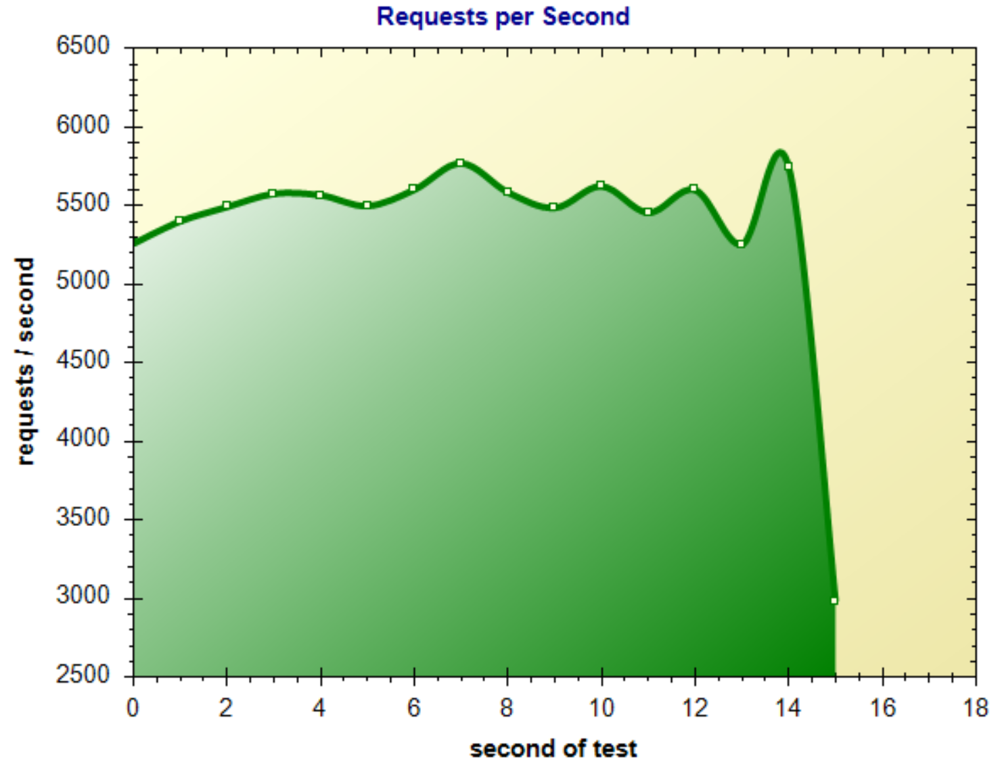

For the purpose of this article I define a *web application* as a HTTP network service, such as what we might build with Asp.NET MVC, Ruby on Rails, Django, Php etc. This article will demonstrate how to write a web application in Typescript that runs on Node.js. 

Why do this?
======

Running as much of an application as possible on the client creates a richer user experience and a better perception of performance. Unfortunately, the client cannot be trusted so enevitably a lot of an application's logic must remain on the server, within the circle of trust. 


Enable code sharing
-------

This unpleasent client/server split can be made a little more bearable by sharing code between the two halves of the application, and this is easier if the code on both sides is written in the same programming language. Useful things to share include types, validation and application specific computations.


Benefits of Node
----------

Node has some advantages as a web server. It is fast, simple and inherently  safely asynchronous. 

Node enables cross platform development and deployment by running well on windows, mac and linux. 

Node has the fastest growing, if not the best quality, package repository. It is a vibrant and creative ecosystem of people who are excited about programming. Consequently, they [wet their pants](https://www.reddit.com/r/learnprogramming/comments/4bo951/eli5_this_whole_fiasco_with_javascript_node_and/) from time to time.

Benefits of Typescript
------------

The static vs dynamic typing debate is beyond the scope of this article. Suffice to say that having compile time type checking can help the self-aware programmer to write more correct software. It is also useful when sharing types between the server and client. 

Typescript has *'optional static typing'*, meaning that you can relax the type checking when it feels good to do so. This can be useful when you want to do dynamic type things and when you are integrating with JavaScript libraries. 

Get Started With Node and Typescript
========================

Step 1, [https://nodejs.org/en/](install node.js). Node itself is just an executable, so you don't really **need** to install it, but doing so will be easier and will install the node package manager (npm) as well. 

Next, install typescript, via npm:

```
$ npm install -g typescript
``` 

Now create your first typescript program (person.ts):

```
interface Person {
    name: string;
    age: number;
}

function birthday(someone : Person) : Person {
    return {name: someone.name, age: someone.age+1};
}

console.dir(birthday({name:"Judy",age:39}));
```

and compile using the typescript compiler (tsc):

```
$ tsc person.ts
```

The output of the typescript compiler is the javascript file `person.js`, which contains:

```
function birthday(someone) {
    return { name: someone.name, age: someone.age + 1 };
}
console.dir(birthday({ name: "Judy", age: 39 }));
```

Wooh! That's just the typescript with the type annotations striped out. This makes sense because typescript is a compile time system, not a runtime system.

> Typescript is a compile time system, not a runtime system. 

Keeping this in mind will help you as you pickup typescript. 

Now we can run our program with node.js

```
$ node person.js
{ name: 'Judy', age: 40 }
```

Now to show what makes typescript useful. Let's intentionally introduce a type error into our program:

```
interface Person {
    name: string;
    age: number;
}

function birthday(someone : Person) : Person {
    return {handle: someone.name, age: someone.age+1};
}

console.dir(birthday({name:"Judy",age:39}));
```

See the type error? The `birthday` function returns a value that is not valid for the type `Person`. When we compile:

```
$ tsc person.ts
person.ts(7,13): error TS2322: Type '{ handle: string; age: number; }' 
is not assignable to type 'Person'.
  Object literal may only specify known properties, 
  and 'handle' does not exist in type 'Person'.
```

Adding a Web Framework
==============

Typescript relies heavily on the JavaScript ecosystem. As mentioned previously typescript does not exist at runtime. So it needs the JavaScript runtime, the JavaScript (or node) standard library, and JavaScript packages. 

For this article we will work with the node web framework [hapi](http://definitelytyped.org/tsd/). Hapi is a javascript framework. To use it in a typescript project we need a type definition file to tell typescript about the types used in hapi. To find Typescript type definitions search the [definitely typed site](http://definitelytyped.org/tsd/) which is a repository of typescript type definition files. The easiest way to install a type definition is to use [tsd](https://github.com/Definitelytyped/tsd#install).

```
$ npm install tsd -g
```

Now you can install the type definitions for Hapi:

```
$ tsd install hapi --save
```

Unfortunately there is nothing synchonizing typescript type definitions to the libraries they define, and when the two get out of sync it causes frustration. I recommend:

1. Start by choosing libraries that have TSD type definitions. You can create your own but it is not easy. 
1. Install the type definition. Inspect its source to discover which version of the JavaScript library the type definition was written for.
1. Install that version of the JavaScript library.

For me, TSD installed type definitions for hapi 13.0.0, so that is the version of the Javascript library I want to install:

```
$ npm install hapi@13.0.0 --save
```

Now create a new typescript program `server.ts`. The first line should be:

```
/// <reference path="typings/tsd.d.ts" />
```

`tsd.d.ts` is a file created by TSD that references the type definitions for all included libraries. This comment tells the typescript compiler where to find type definitions. 

Next, add the code for a simple hapi web server:

```
/// <reference path="typings/tsd.d.ts" />

import * as Hapi from 'hapi';

const server = new Hapi.Server();
server.connection({ 
    host: 'localhost', 
    port: 8000 
});

server.route({
    method: 'GET',
    path:'/hello/{name}', 
    handler: function (request, reply) {

        return reply('hello ' + request.params['name']);
    }
});

server.start((err) => {
    if (err) { throw err; }
    console.log('Server running at:', server.info.uri);
});
```

Compile and start:

```
$ tsc server.ts
$ node server.js
Server running at: http://localhost:8000
```

Now navigate your browser (or curl) to `http://localhohst:8000/hello/Eugene`:

```
$ curl http://localhost:8000/hello/Eugene
hello Eugene
```

Automatically Compiling and Restarting the Server
------------------------- 

The development workflow at this point is clunky. When a change is made to the typescript source you need to recompile the application, then restart the hapi server to pickup the changes.

```
$ tsc server.ts
$ node server.js
```

This gets old quickly. We can have typescript automatically detect and compile changes by using the -w flag:

```
$ tsc server.ts -w
```

Not only is this more convenient, it is also faster. By keeping the process alive typescript is able to implement incremental compilation (only recompile the bits that have changed). 

To automatically restart the server we can use the `node-dev` package.

```
$ npm install node-dev -g
```

Then run the program with `node-dev` instead of `node`.

```
$ node-dev server.js
```

`node-dev` detects when a required module is changed and restarts the process. 

Performance
========

Node is supposed to be fast right? As written, our simple server is processes about 1,600 reqs/s. 


Not bad, but nothing special considering it doesn't do much. This is because node is single threaded and therefore only capable of utilizing a single CPU core. We can fix this (somewhat) using node's 'cluster' module to start a process per CPU core. The clustered code looks like:

```
/// <reference path="typings/tsd.d.ts" />

import * as cluster from 'cluster';
import { cpus } from 'os';
import * as Hapi from 'hapi';

const numCPUs = cpus().length;

if (cluster.isMaster) {
  for (var i = 0; i < numCPUs; i++) {
    cluster.fork();
  }
  cluster.on('exit', (worker, code, signal) => {
    console.log(`worker ${worker.process.pid} died`);
  });
} else {
    const server = new Hapi.Server();
    server.connection({ 
        host: 'localhost', 
        port: 8000 
    });

    server.route({
        method: 'GET',
        path:'/hello/{name}', 
        handler: (request, reply) => reply('hello ' + request.params['name'])
    });

    server.start((err) => {
        if (err) { throw err; }
        console.log('Server running at:', server.info.uri);
    }); 
}
```

This pushes the reqs/s up to 5,700.



That's better :)