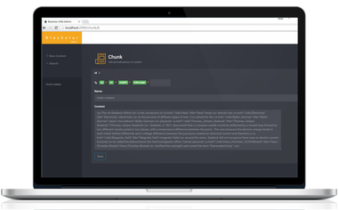
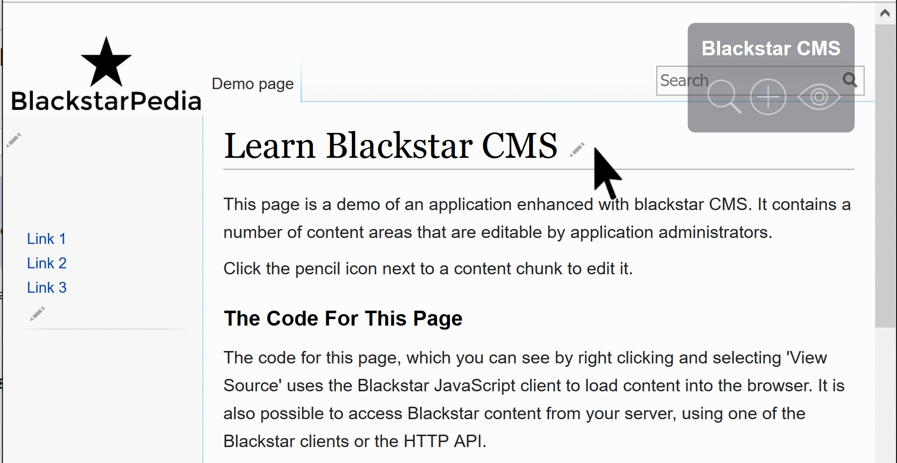
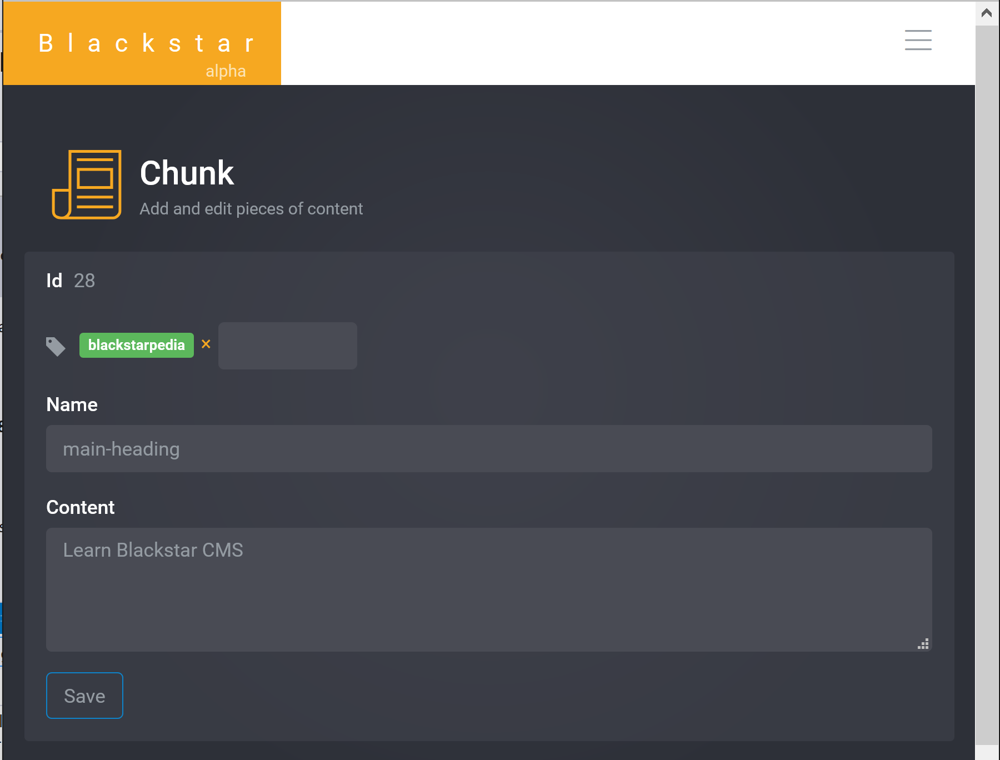
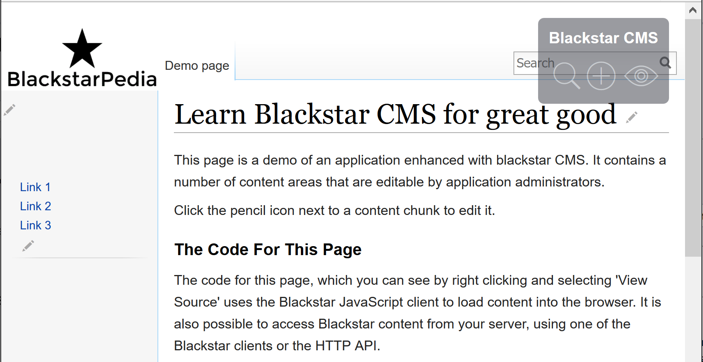

<link rel="stylesheet" href="prism.css">

> Managed content in custom applications is useful, but building applications inside of a CMS is unproductive and miserable. **Blackstar CMS is an API-first, headless CMS, built for application developers.**

I recently wrote that [Hosting a custom application inside of a CMS is a terrible idea](/articles/2016-04-26-blackstar-headless-cms/). Now, I present a solution. 

[Blackstar CMS](http://blackstarcms.net/) is an API-first, headless CMS, built for application developers.

It allows you to put content in your custom web application, and provide a delightful content management experience for application administrators.

Blackstar CMS is currently in alpha preview. To access the alpha, signup for the Blackstar CMS newsletter below:

---------------

<!-- Begin MailChimp Signup Form -->
<link href="//cdn-images.mailchimp.com/embedcode/horizontal-slim-10_7.css" rel="stylesheet" type="text/css">

<form action="//blackstarcms.us13.list-manage.com/subscribe/post?u=4c9086940c1cc2e74eb2526b9&amp;id=080fe1a12f" method="post" id="mc-embedded-subscribe-form" name="mc-embedded-subscribe-form" class="validate" target="_blank" novalidate>
    

	<label for="mce-EMAIL">Newsletter</label>
	<input type="email" value="" name="EMAIL" class="email" id="mce-EMAIL" placeholder="email address" required>
    <!-- real people should not fill this in and expect good things - do not remove this or risk form bot signups-->
    
<input type="text" name="b_4c9086940c1cc2e74eb2526b9_080fe1a12f" tabindex="-1" value="">

    
<input type="submit" value="Subscribe" name="subscribe" id="mc-embedded-subscribe" class="button">

    

</form>

-----------------

A tour of Blackstar CMS
===========

An application using Blackstar CMS to embed managed content might look something like this:

If I, as an application administrator, want to change the main heading, I click its edit link, and am taken to the blackstar edit page:

 

I can make a change, and see it reflected immediately:

Some core design goals for blackstar are:

* it should be simple for developers to integrate into their application and simple for administrators to use to manage content
* it should be deployed on premise (see Why a SaaS CMS is not for everyone)
* it should be simple to deploy and administer

The Developer Experience
=================

There are different ways to integrate with Blackstar CMS. For a SPA type application this can be done by including elements decorated with the <code class=" language-markup">data-blackstar-name</code> attribute. This tells Blackstar the name of the content chunk that should be inserted into that element. Here is an example from the BlackstarPedia demo.

<pre class=" language-markup"><code class=" language-markup">&lt;h2 data-blackstar-name="smaller-heading"/&gt;
&lt;div data-blackstar-name="second-content"/&gt;
</code></pre>

<code class=" language-markup">smaller-heading</code> and <code class=" language-markup">second-content</code> are the names of Blackstar content chunks. 

Next, add the Blackstar client script, create a client, and specify what content should be bound to this page (all chunks with the tag <code class=" language-markup">blackstarpedia</code>). 

<pre><code class=" language-javascript">&lt;script src="blackstar-cms-client.js"&gt;&lt;/script&gt;

var blackstar = new Blackstar.Client('http://localhost:2999/', { showEditControls: true });
blackstar.get({ tags: ['blackstarpedia'] }).then(function (chunks) {
  blackstar.bind(chunks);     // bind by matching data-blackstar-name values to chunk names 
});
</code></pre>

That's enough to populate the page with content and allow application administrators access to create and edit content. 

Blackstar CMS content can also be accessed via HTTP or a [JavaScript client](https://github.com/Blackstar-CMS/javascript-client/blob/master/api.md) (browser or node.js). 

Why a SaaS CMS is not for everyone
================

When I searched for a developer-oriented CMS designed for adding manageable content to custom applications I found a crowded market of hosted solutions (SaaS) and very little support for self-hosting. There are three reasons why I think that a hosted CMS is a bad idea for most situations.

1. It is an operational dependency
----------------------------------

If your hosted CMS goes down, then your application becomes unavailable, or at least has no content.   

2. You depend upon continued operation of the service
---------------

Hundreds of thousands of applications depended on a backend-as-a-service called *Parse*. In January 2016 [Facebook shutdown Parse](http://blog.parse.com/announcements/moving-on/), leaving all those customers stranded. It probably made sense for Facebook, but it left their customers with no options. Other SaaS products like [Charm shutdown before they even launch](https://unicornfree.com/2013/why-we-shut-down-charm-on-the-eve-of-public-launch-at-48kyear-and-growing).

When you depend upon a third-party service for the runtime operation of your application you lose control of your own destiny. 

3. Latency
-----------

Web applications always have *some* latency. It's the time it takes for a request to travel from the client to your server, and then back again. 

Using a SaaS CMS adds the latency of another network request. Now a request has to travel from the client, to your server, to your SaaS CMS server, back to your server, then back to the client. And that makes your app feel **S  L  O  W**.  

Blackstar CMS is currently in alpha preview. To access the alpha, signup for the Blackstar CMS newsletter below:

---------------

<!-- Begin MailChimp Signup Form -->
<link href="//cdn-images.mailchimp.com/embedcode/horizontal-slim-10_7.css" rel="stylesheet" type="text/css">

<form action="//blackstarcms.us13.list-manage.com/subscribe/post?u=4c9086940c1cc2e74eb2526b9&amp;id=080fe1a12f" method="post" id="mc-embedded-subscribe-form" name="mc-embedded-subscribe-form" class="validate" target="_blank" novalidate>
    

	<label for="mce-EMAIL">Newsletter</label>
	<input type="email" value="" name="EMAIL" class="email" id="mce-EMAIL" placeholder="email address" required>
    <!-- real people should not fill this in and expect good things - do not remove this or risk form bot signups-->
    
<input type="text" name="b_4c9086940c1cc2e74eb2526b9_080fe1a12f" tabindex="-1" value="">

    
<input type="submit" value="Subscribe" name="subscribe" id="mc-embedded-subscribe" class="button">

    

</form>

-----------------

