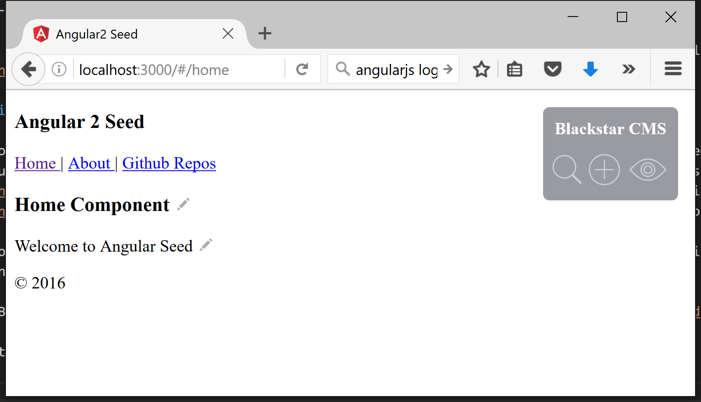
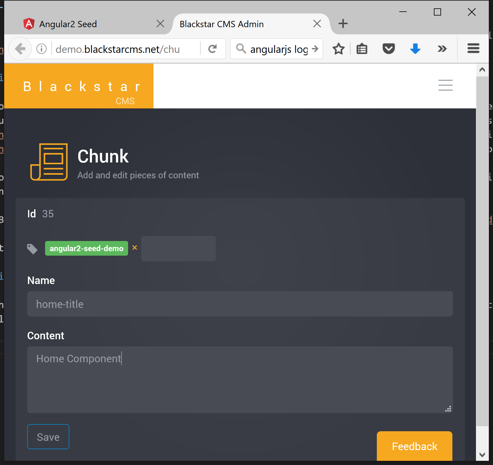
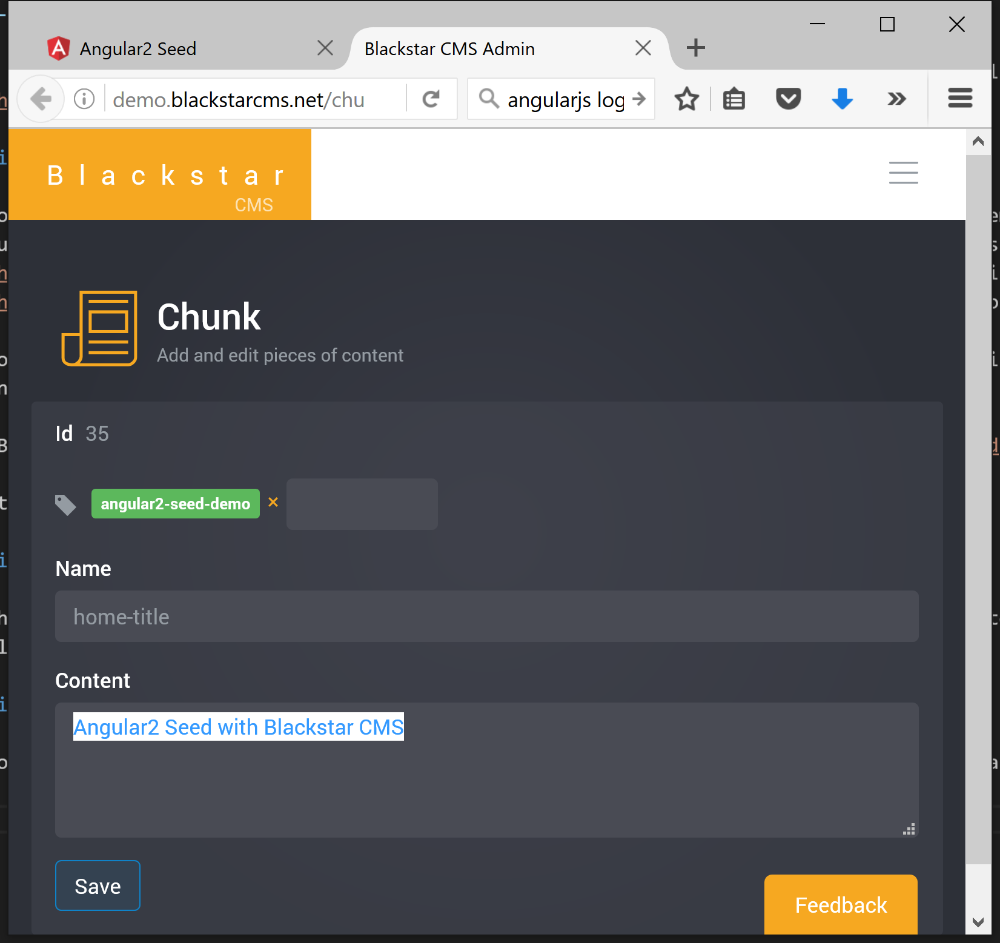
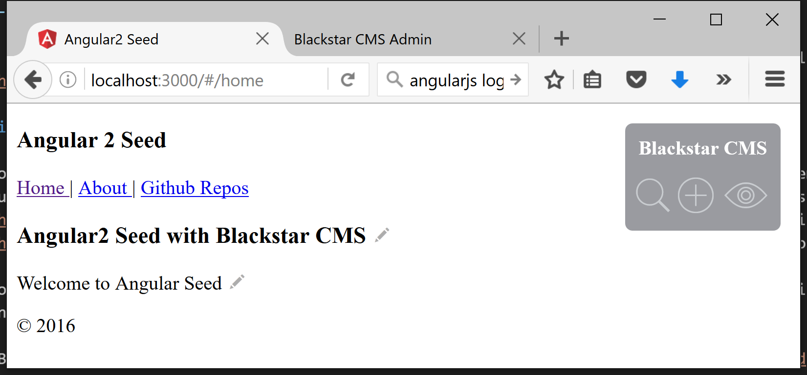

> [Blackstar CMS](http://blackstarcms.net/) now has a [public sample showing how to add managed content to an Angular2 (AngularJS) application](https://github.com/Blackstar-CMS/samples#angular2-seed).


Most, if not all, public facing web applications would benefit from some content management to give administrators a way to keep the content current and to experiment with different marketing material. [Building applications inside of a CMS has been tried and found wanting](http://withouttheloop.com/articles/2016-04-26-blackstar-headless-cms/). Recently, I [introduced Blackstar CMS](http://withouttheloop.com/articles/2016-04-27-headless-cms/) as a solution to this problem.

To help developers learn how to use Blackstar CMS to add managed content to their applications I am producing a number of samples, including one for AngularJS.

[Blackstar CMS AngularJS Sample](https://github.com/Blackstar-CMS/samples#angular2-seed)

This sample is based on [Google's Angular2 seed sample](https://github.com/angular/angular2-seed).

Start the Angular2 sample with `npm start` and you will see:



The little pencil icons indicate the managed content. If I click the pencil icon next to the 'Home Component' heading I am taken to the Blackstar CMS edit page for that content:



Now I can change the content to something more appropriate like 'Angular2 Seed with Blackstar CMS':



and now the content has been changed:



The change to the Angular2 Seed sample to make this work was trivial. 

### Steps used to integrate angular2 and Blackstar CMS

1. Add the Blackstar CMS JavaScript Client
        
   `npm install blackstar-cms-client`
   
1. Add a typescript definition file ([blackstar-cms-client.d.ts](https://github.com/Blackstar-CMS/samples/blob/master/angular2-seed/src/app/components/home/blackstar-cms-client.d.ts)) for Blackstar CMS JavaScript client (included in the npm package). *This step is only necessary for projects that use Typescript*.  

1. Remove the hard coded content from [home.html](https://github.com/Blackstar-CMS/samples/blob/master/angular2-seed/src/app/components/home/home.html) and add `data-blackstar-name` attributes with appropriate names:

    ```html
    <h3 data-blackstar-name="home-title"></h3>
    <p data-blackstar-name="home-content"></p>
    ``` 

1. Create the content in the [Blackstar CMS admin portal](http://demo.blackstarcms.net)

1. Modify the [Home](https://github.com/Blackstar-CMS/samples/blob/master/angular2-seed/src/app/components/home/home.ts) component to reference the type definition file and fetch content from Blackstar CMS and bind it to the UI:

    ```JavaScript
    /// <reference path="blackstar-cms-client.d.ts" />

    ...
    
    export class Home {
        constructor() {
            var blackstar = new Blackstar.Client('http://demo.blackstarcms.net/', { showEditControls: true });
            blackstar.get({ tags: ['angular2-seed-demo'] }).then(function (chunks) {
                blackstar.bind(chunks);     // bind by matching data-blackstar-name values to chunk names 
            });
        }
    }
    ```

There are other, more manually, ways to integrate Blackstar CMS content into an AngularJS application, but the technique shown here is an easy and effective way to get started. 