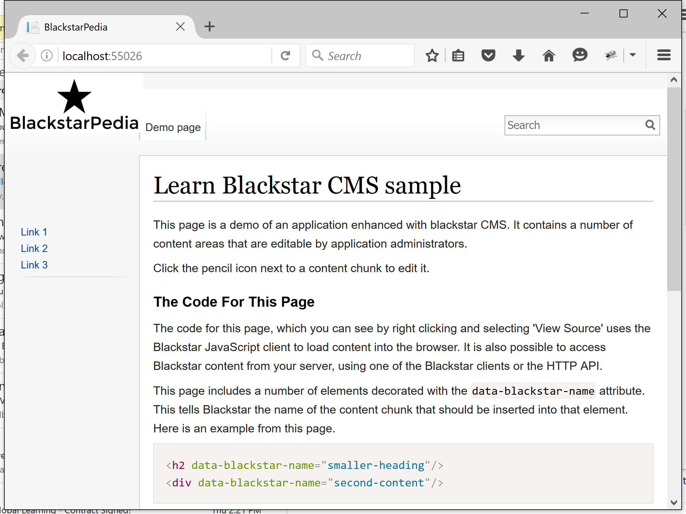
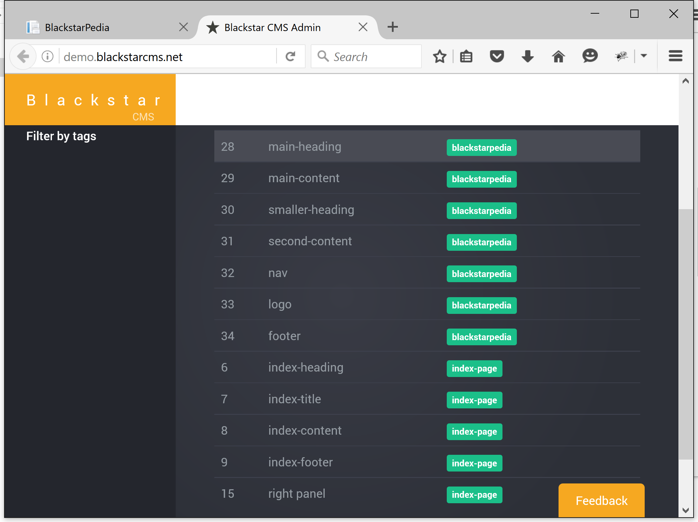

> [Blackstar CMS](http://blackstarcms.net/) now has a [public sample showing how to add managed content to an ASP.NET MVC web application](https://github.com/Blackstar-CMS/samples#net-aspnet-mvc).

Most, if not all, public facing web applications would benefit from some content management to give administrators a way to keep the content current and to experiment with different marketing material. [Building applications inside of a CMS has been tried and found wanting](http://withouttheloop.com/articles/2016-04-26-blackstar-headless-cms/). Recently, I [introduced Blackstar CMS](http://withouttheloop.com/articles/2016-04-27-headless-cms/) as a solution to this problem.

To help developers learn how to use Blackstar CMS to add managed content to their applications I am producing a number of samples, including one for ASP.NET MVC.

[Blackstar CMS ASP.NET MVC Sample](https://github.com/Blackstar-CMS/samples#net-aspnet-mvc)

This sample is based on the ASP.NET MVC web project template. 

When you start the application you will see:



This is an ASP.NET MVC web application featuring content loaded from Blackstar CMS. The content can be edited via the Blackstar CMS admin interface. 



How to integrate ASP.NET MVC and Blackstar CMS
============================

1. Install the [Blackstar CMS .NET client](https://www.nuget.org/packages/Blackstar/1.0.0) from nuget

    `> Install-Package Blackstar`

1.  Within [the MVC controller](https://github.com/Blackstar-CMS/samples/blob/master/dotnet/dotnetSample/Controllers/HomeController.cs) request the required content (e.g. all content with the 'blackstarpedia' tag).

    ```C#
    public async Task<ActionResult> Index()
    {
        var client = new BlackstarClient("http://demo.blackstarcms.net");
        var content = await client.GetByTagAsync("blackstarpedia");
        return View(HomeModel.FromContentChunks(content));
    }
    ```

1. Within [the view](https://github.com/Blackstar-CMS/samples/blob/master/dotnet/dotnetSample/Views/Home/Index.cshtml) place the content in the correct locations.

    ```
    <h2>@Html.Raw(Model.smallerHeading)</h2>
    ```

    Note the use of `Html.Raw` to prevent the content from being escaped. 
    
That's it! For more information [grap the code from github, or have a look at one of the other sample projects](https://github.com/Blackstar-CMS/samples). 