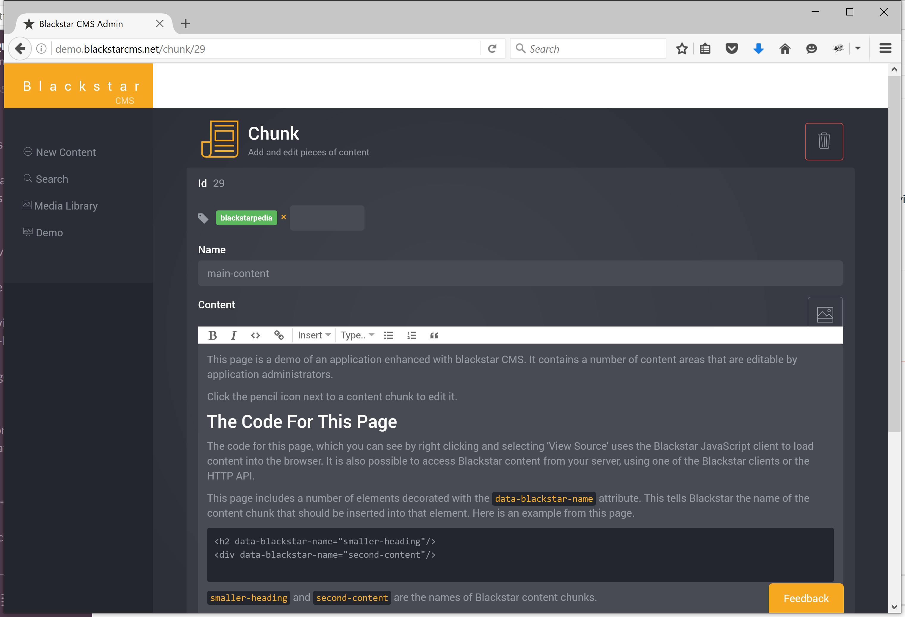
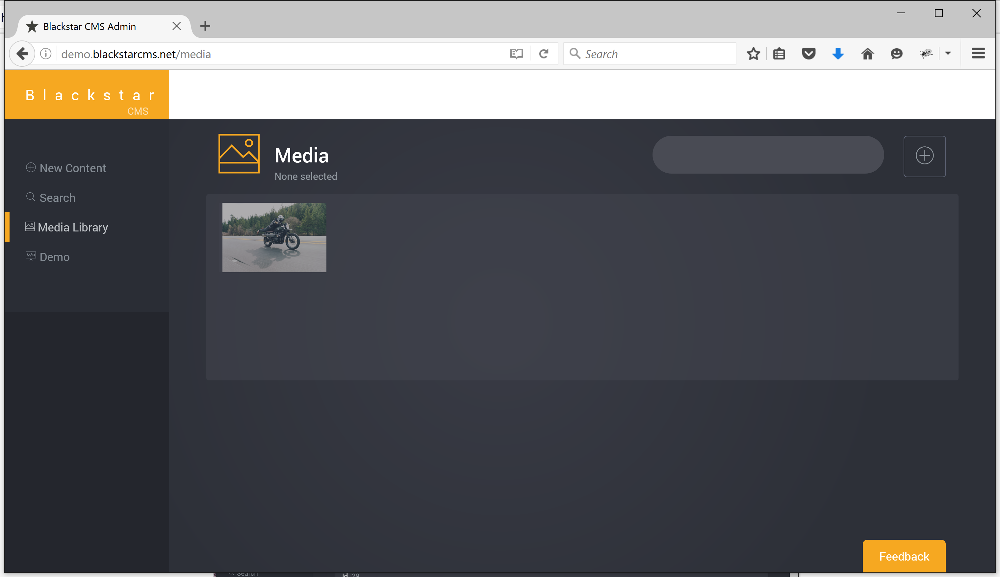
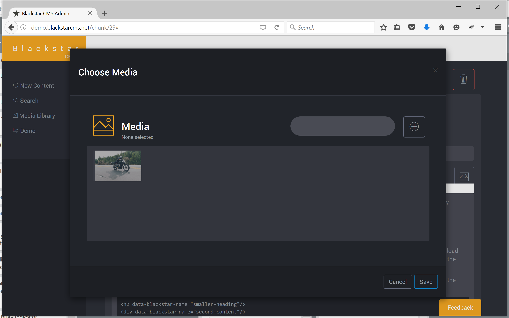

> I [announced Blackstar CMS](http://withouttheloop.com/articles/2016-04-27-headless-cms/) 6 weeks ago. Since then the mailing list has grown steadily (join [here](http://blackstarcms.net/#stayintouch)) and the product has moved closer to release. 

Many things have changed in the last six weeks (try the [demo](http://demo.blackstarcms.net/), here are some highlights:

* rich text editing
* media library
* sensible caching 

Rich Text Editing
=======

Blackstar CMS now uses [ProseMirror](https://prosemirror.net/) for content editing. It is a simple, but pleasant, editing control. The intention is that basic editing can be done via the WYSIWIG editor, for anything more complicated it is better to work with the raw HTML directly. 

Media Library
=========

A CMS is not that useful without support for images and other media. The *Media Library* is Blackstar CMS's central home for all media. Files can be uploaded by dragging onto the upload button, or by clicking the button and selecting one or more files from the file browser. 

The media library has a search field for finding assets in a large library.

When editing content we can add media by launching the media library in a dialog:

Being able to nest user interface components like this (this is the media library inside of the content editing component) is a fun design challenge for a rich web application. 

 Sensible Caching
 ========

 Caching is an interesting challenge for a CMS. We want content cached, but we also want to always see the latest content. Ultimately, Blackstar CMS will allow caching to be configured for content. At the moment I have set the cache to a fixed time period (24 hours). Within that time period users will only download content once. Subsequent requests will use the cached copy without ever making a request to the Blackstar CMS server. Administrators can force a cache refresh by using the browser refresh feature (F5). 

 Caching of media is simpler. Blackstar CMS associates a unique code with each asset, based on the content of the asset. All media are cached forever. If an image changes, upload a new asset and change the links that point to it. 

 What's Next?
 =======

 The work coming up includes providing raw HTML editing of content and a number of minor tweaks. Then I will build an installer and make it available for enthusiastic users. **Please leave a comment if you have a preference for a linux or windows installer.**
