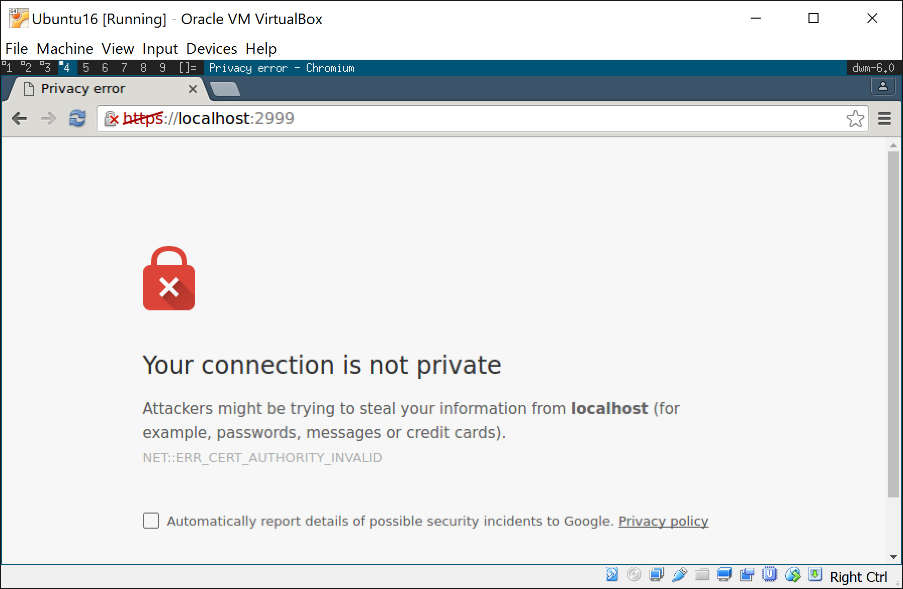

There are two primary architectures for using an API-first CMS like Blackstar CMS. 

1. Modern web applications built with Angular.js, React, Ember etc will tend to load their application data from their application server, and their content data directly from Blackstar CMS. This means that the end user's browser connects directly to Blackstar CMS.

1. Server rendered applications using Asp.net MVC, Rails, Django etc will load content from Blackstar CMS during the process of rendering the page. In this scenario Blackstar CMS is only accessed by the web server and can be deployed within a private network.

In both cases, and definitely the first, it may be advantageous to secure the connection to Blackstar CMS. Fortunately, the internet has a robust infrastructure for solving this problem. [TLS/SSL](https://en.wikipedia.org/wiki/Transport_Layer_Security) provides communication security by encrypting the communication, authenticating the identity of the server, and guaranteeing the integrity of the message. 

Securing Connections to Blackstar CMS
=====================================

To secure a connection you will need to obtain a private key and a certificate. There are several ways to do this:

1. Create a self-signed certificate. This will encrypt the connection but will fail to authenticate the identity of the server.
1. Obtain a free certificate from [Let's Encrypt](https://letsencrypt.org/).
1. Purchase a certificate from a certifying authority. 

Creating a Self-signed Certificate
--------------------------------

For testing purposes a self-signed certificate may suffice. Do not attempt to use a self-signed certificate for production use.

To create a self-signed certificate and private key:

1. Install OpenSSL (if you don't have it already)
1. Use the following command
```
openssl req \
       -newkey rsa:2048 -nodes -keyout domain.key \
       -x509 -days 365 -out domain.crt
```

This certificate/key pair will be valid for 365 days. 

Configure Blackstar CMS to use TLS/SSL
---------------

To configure Blackstar CMS to use a TLS secure connection you must firstly obtain a private key and certificate (see above). 

Next, edit your Blackstar CMS configuration file (`config.json`) and set values for the `pathToKey` and `pathToCert` options. 

```javascript
{
  "pathToKey": "/home/fred/domain.key",
  "pathToCert": "/home/fred/domain.cert"
}
```

Then restart Blackstar CMS for the changes to take effect. 

When accessing Blackstar CMS you will now need to change the protocol from `http` to `https`.

If you used a self-signed certificate you will get an error because the certificate is not signed by a Certificate Authority (CA).



For testing purposes you can accept the error and proceed to access Blackstar CMS via an encrypted connection. For production, use Let's Encrypt or a Certificate Authority to obtain a trusted certificate. 