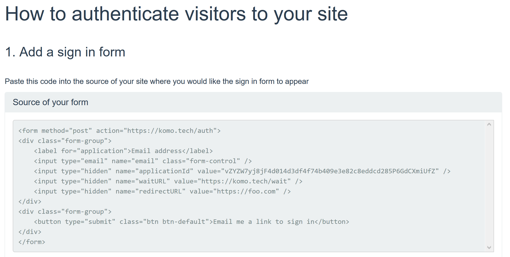

[Komo](https://komo.tech/) was already a secure and easy way to add passwordless authentication to web applications. However, it is now even easier. 

The process of adding Komo passwordless authentication to a web applications has been reduced to two steps:

1. Add the form code to your application

    The Komo dashboard shows the source code for the required login form. Simply copy and paste the form code into your application where you would like your login form to appear.

    

1. Implement a webhook

    Your webhook endpoint is sent an authentication token. Post the token to `https://komo.tech/verify`. The response will look something like:

    ```
    {
        "isValid": true,
        "email": "john@adomain.com",
        "message": ""
    }
    ```

    See the [full API documentation](https://app.swaggerhub.com/apis/liammclennan/Komo/1.0.0).

    If `isValid` is true, then you have verified that the current user has access to the email address in the response (`john@adomain.com` in the example above) and may login the user using your web framework. 

See [https://glitch.com/edit/#!/immense-sneeze?path=server.js:22:11](https://glitch.com/edit/#!/immense-sneeze?path=server.js:22:11) for a full working example.

(Note: It is also possible to directly verify the [JWT token](https://en.wikipedia.org/wiki/JSON_Web_Token) if you wish to avoid the network request to `https://komo.tech/verify`.)