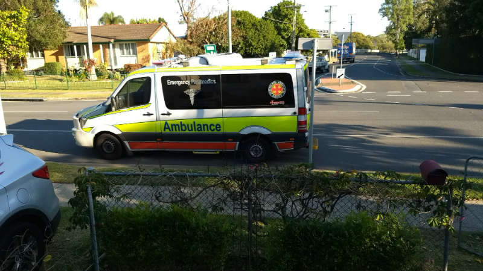
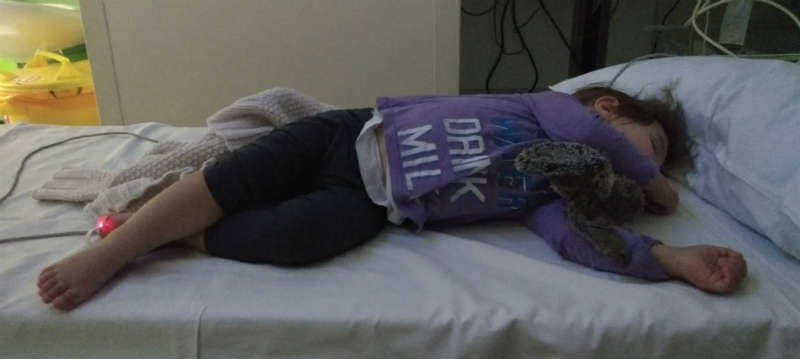
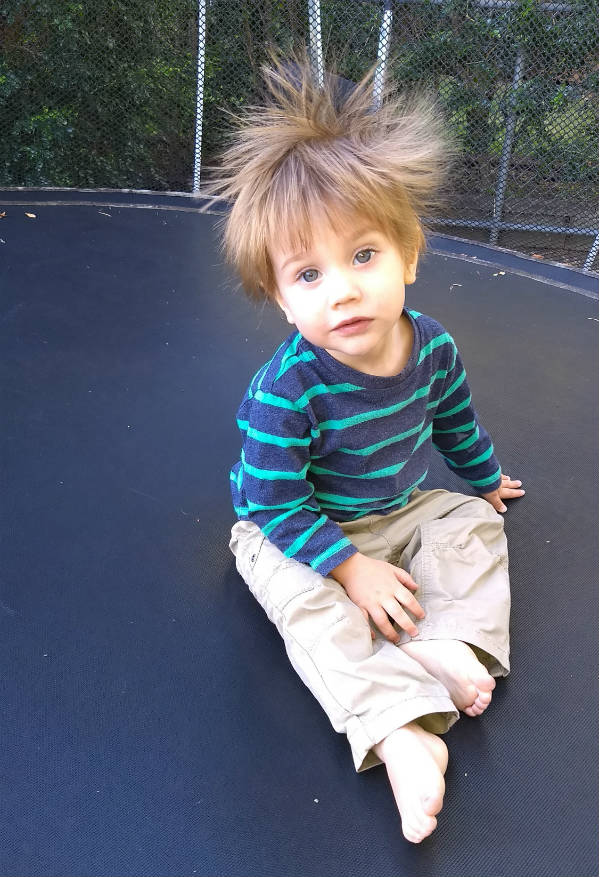

It was towards the end of Monday morning peak hour. I had just arrived at the train station on my way to work when my phone rang.

> "Should I do CPR?

> Hugo's not breathing. 

> Come home quick."

That was it verbatim. I did not get a word in. The caller was my wife. Hugo is our one year old child. 

I took my wife's suggestion and began to run home (I walk to the train station). My backpack full of computers was slowing me so I paused on my way paste a large tree, took my car keys out of the bag, and then tossed the rest as deep as I could under the tree's folliage. 

Thus unencumbered, my progress home was more rapid. I was terrified, thinking that Hugo was dead or dying.

I passed one block, then a second, before I saw my neighbour's SUV screeching to a halt, on the wrong side of the road, across an intersection. I jumped in the passenger seat and barely had time to fail to close the door properly before we were off with a tyre howl and a petrol roar. 

When I got inside Hugo was on my bed, lying on his side, moving in and out conciousness. His breathing was faint but detectable. His seizure had lasted five minutes and included two minutes without breathing. The ambulance had been called so we watched him and waited. After forty minutes I started to worry that the ambulance service had somehow lost track of us, so I called again. The lady I spoke to assured me that the ambulance would be there as soon as possible and asked me a silly question, "is he breathing?". After forty minutes without breathing they could have told the ambulance to slow down. 

One hour and ten minutes after we called, the ambulance arrived. 

The paramedics were kind and helpful. They took my wife and child to the new Children's Hospital. I followed in the car. The paramedics told me it would take a while to get processed through emergency so I stopped by the train station and retrieved my bag from under the tree. 

We spent most of the day in the Emergency Department with a grumpy toddler. He alternated between sleep and extreme irritability. I am told that following his seizure he would have a headache and a metallic taste in his mouth. 

Eventually we were released with a diagnosis of "febrile convulsion", a condition associated with rapid change in fever temperature in young children. This was odd because Hugo did not have a temperature when he had his seizure.

The next day it was my turn. I was carrying Hugo because he would scream if I put him down when my daughter called me to the bathroom for some toilet emergency. I put Hugo down and noticed it was odd that he refused to stand on his feet. I lowered him into a sitting position and went to help my daughter. In the corner of my eye I saw Hugo gently lie down, extend his arms like a cartoon Egyptian mummy and begin to convulse. It was like [this](https://www.youtube.com/watch?v=7rK6-JpxR7s) youtube video (or [this one](https://www.youtube.com/watch?v=aIcYPQsnXV4)), but with his eyes rolled back so I only saw the whites. That lasted about a minute followed by a period of eerie stillness with Hugo completely still between breaths 20 seconds apart. 

We went back to the hospital and again we were released after a few hours. It is easy to diagnose a seizure. It is much harder to diagnose the cause so Hugo will be having some tests when we can get him booked in. Here he is the day after his second seizure, starting to feel a little better, and demonstrating static electricity. 

