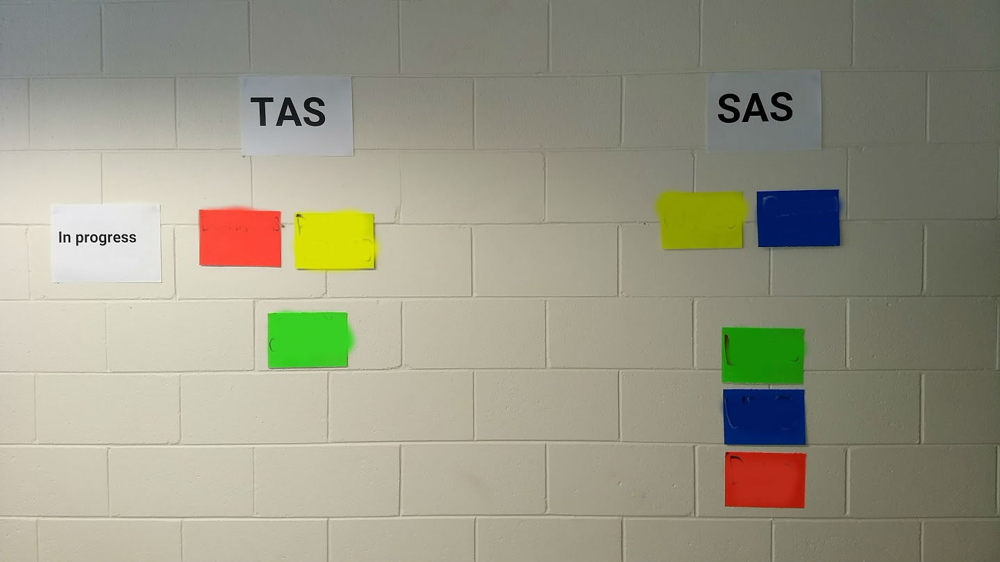
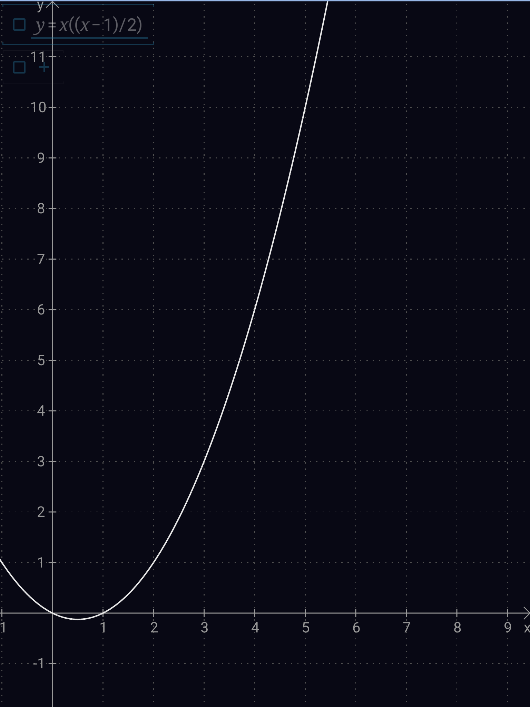
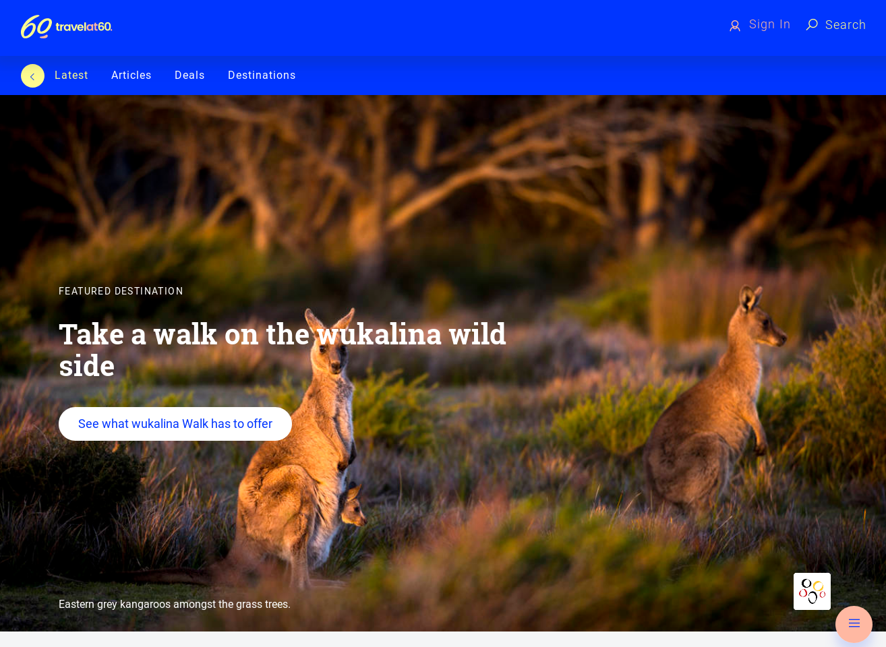

The product development process, left to its own devices, does not proceed with order and efficiency to the ideal output. Without constant guidance, and vigilance, progress will be retarded by individual interests, disproportionate reactions, responding to stakeholder requests, scope creep, over-engineering and decisions made without all of the necessary context.

> Successful teams optimize their path to agreed goals by minimizing waste. Build only what is absolutely necessary, when it is absolutely necessary.

Product delivery management happens at two levels. The low-level management of planning the next sprint has been well understood, but focuses on activity over outcome. The higher-level view of why we are doing what we are doing is typically neglected and defaults to a shopping list of features that someone high in the org chart thinks are desirable. 

At [Starts at 60](https://startsat60.com/), we have developed a simple and effective process with three principal steps:

* [Identify the goals](#identify-goals) that the product serves. All activity must be mapped to at least one goal.
* [Use Impact Mapping to derive strategic initiatives from the goals](#derive-strategic-initiatives-from-the-goals).
* [Organise the strategic initiatives into a highly-visible, living roadmap that forces prioritization](#create-a-roadmap). 

Identify Goals
=====

The first and most important step is to pick your goals. A good team working to clear goals will get buy without anything else. Choosing goals sounds easy but it is not. [The Goal Tree](https://withouttheloop.com/articles/2016-08-24-goaltree/) describes a process for getting to real business goals. 

Guidelines for Goal Selection
-----------

1. Keep the list of goals small. Goals will tend to conflict with each other and if the set of possible conflicts is large things become unmanageable. We work to 4 goals and I think that is about the practical limit. The following graph shows how quickly the number of potential conflicts increases as the number of goals increases.
    

1. Goals will often be financial and there is nothing wrong with that. 

1. Beware of features expressed as a goal. If a feature is suggested ask *why* that feature is desirable. Unearthing the goal gives the team the opportunity to replace the selected feature with a better one. 

1. Goals should be SMART (specific, measurable, achievable, relevant and time-bound). When the goal is defined also define when the metric will be measured, how it will be measured and what the expected value should be. 

Derive Strategic Initiatives from the Goals
=======================

Goals define where you want to go. [Impact Mapping](https://www.impactmapping.org/) is a collaborative, strategic planning technique that helps a team to determine which initiatives will have the most impact, as defined by the agreed goals.

The impact mapping process is:

1. Identify the actors who can help or hinder our progress to the goals.
1. For each actor, list the behaviour change we would like them to make.
1. Brainstorm initiatives that could be undertaken to achieve the desired behaviour changes.
1. Choose which of the initiatives identified are the most appropriate to pursue. 

Much of the impact mapping process relies on *assumptions* that should be made explicit and documented. The impact map is a living document that must be updated as circumstances change or assumptions are dis-proven. 

The output of the impact mapping process is the set of initiatives most likely (according to the information on hand) to result in hitting our goals.

Create a Roadmap
===========

Once we know the things we should do we need to prioritize them into a roadmap. At [Starts at 60](https://startsat60.com/) we have two products: a [media site](https://startsat60.com/) and a [travel site](https://travel.startsat60.com/).

*Starts at 60*

*Travel at 60*

The technology team has commandeered a wall to display a simple roadmap. Each column is a product (TAS & SAS). Planned initiatives are represented by coloured cards and ordered by priority. The top row shows which initiatives are currently being developed (in progress). Each in progress initiative has a headshot of the person responsible for delivery attached.

This information was originally captured in a Trello board, but it did not work. People only engage with Trello if they choose to pull the information (by going to the Trello board). The advantage of a large, wall display is that it pushes the information to stakeholders, whether they want it or not ;)

In a startup things can change quickly. The huge-visible-roadmap is a great tool to at least document what the current plan is. Keep a stack of cards and some markers handy.

Dealing with Great New Ideas
==============

The curse of any roadmap, or any product planning, is the "great new idea". When a great new idea is presented to the delivery team the default assumption is always that it will happen, and that it will not affect the delivery of all the initiatives already in progress. The process detailed above provides tools for dealing with this situation. 

Firstly, the great new idea must be worked into the Impact Map, so that it can be mapped to the agreed business goals. This will weed out those great ideas that won't contribute to the goals. 

Assuming the "great new idea" is in fact going to have a significant impact then the roadmap wall forces the decision about where to put the "great new idea". Does it go at the top, displacing all other initiatives? Or does it go at the end of the line? Any choice is acceptable, the import thing is that a choice is made.