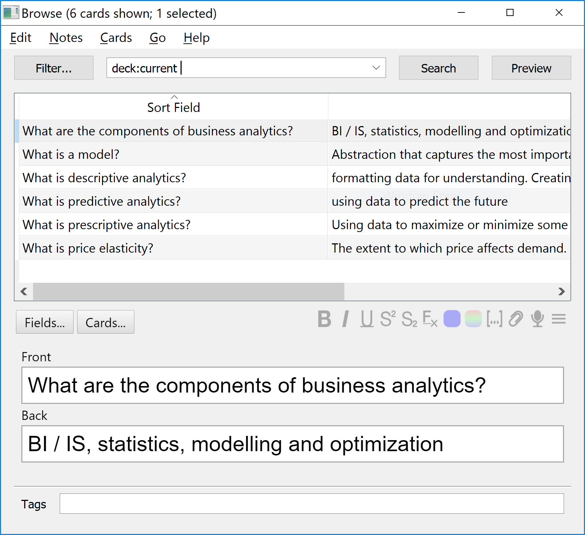

Each time I go back to studying I decide that a better use of my time, instead of studying, is to solve the problem of markdown study notes with embedded spaced repetition flash cards. How's that for procrastination?

I studied mathematics in 2015 and compiled a [comprehensive set of markdown notes](https://github.com/liammclennan/maths). Here's an excerpt:

```markdown
Polynomial Derivatives
---

$$\frac{dx^n}{dx} = nx^{n-1}$$

<script type="flashcard">
Q>>> What is the derivative of $$ 7x^4 $$? <<<
A>>> $$ 28x^3 $$ <<<
</script>

### Constants

The derivative of a constant is `0`.

$$\frac{dc}{dx} = 0$$

This can be found from the derivative of polynomials, since $5 = 5x^0 -> 0 * 5x^-1 = 0$.

<script type="flashcard">
Q>>> What is the derivative of $$ 99 $$? <<<
A>>> $$ 0 $$ because $$ 99 = 99x^0 = 0 * 99x^-1 = 0 $$ <<<
</script>
```

Note the embedded microformat metadata describing flash cards:

```html
<script type="flashcard">
Q>>> What is the derivative of $$ 7x^4 $$? <<<
A>>> $$ 28x^3 $$ <<<
</script>
```

This information is not displayed in the notes, but is there to generate flash cards for [spaced repetition](https://en.wikipedia.org/wiki/Spaced_repetition). At the time I built a web application to pull out the flash cards for studying. Sometime in the last three years the domain expired, and the source code is trapped in my bitbucket account that I can't login to anymore.  `¯\_(ツ)_/¯`

This year I'm starting an MBA, and immediately felt the need to record notes in markdown. Naturally, that was followed by a desire to embedd flash cards. Since I've lost my last solution, I created a new one. I'm using github to edit and store the markdown files, so I delimit the flash card with comments (this is the only content I could find that github doesn't display):

```xml
<!---

--->
```

For the questions and answers I use an xml-like syntax for easy parsing:

```xml
<!---
<question>What is a blah?</question>
<answer>It's a foo!</answer>
  
<question>What is a foo?</question>
<answer>It's a blah!</answer>
--->
```

Fetching Content From Github
---------------

Fortunately, Github provides a [simple API for fetching content from a repository](https://developer.github.com/v3/repos/contents/). My solution is currently a [codepen script](https://codepen.io/liammclennan/pen/oaXpya?editors=0010), so JavaScript. This function recursively navigates a github repository and builds a collection of urls to fetch those files. 

```javascript
const collectFilesInDirectory = (directoryUrl) => {
  return fetch(directoryUrl)
    .then((response) => response.json())
    .then((entries) => ({
      files: entries.filter(e => e.type === "file"),
      directories: entries.filter(e => e.type === "dir")
    }))
    .then(({files, directories}) => Promise.all(directories.map((d) => collectFilesInDirectory(d.url)))
          .then((fs) => flatten(fs))
          .then((flattened) => flattened.concat(files.map(f => f.url)))
    )
};
```

At a high level, it adds the files in the current directory to a collection, as well as doing the same thing for all sub-directories (and their sub-directories).

E.g.

```javascript
collectFilesInDirectory("https://api.github.com/repos/liammclennan/mba/contents")
  .then(console.log);

// […]
// 0: "https://api.github.com/repos/liammclennan/MBA/contents/Business-Analytics/index.md?ref=master"
​// 1: "https://api.github.com/repos/liammclennan/MBA/contents/README.md?ref=master"
```

Parsing Flash Card Data Out of Markdown
-------------

Next task was to extract the metadata blocks out of markdown files. This involved re-learning JavaScript regular expressions. The thing that slowed me down the most was that the `RegEx.exec` can only do one match at a time, so if you want to select all of the `<!--- --->` blocks in a markdown file you must call `exec` repeatedly until it stops finding matches, which I did with this regular express `/(?:<!---\n?)([\s\S]*?)(?:\n?--->)/gm`. 

Once we have the microformat blocks we must extract the pairs of questions and anwsers. This calls for another regular expression, `/(?:<question>\n?)([\s\S]*?)<\/question>(?:[\s\S]*?)<answer>([\s\S]*?)(?:\n?<\/answer>)/gm`. 

This gives me a nice collection of question / answer pairs, each of which will become a study flash card.

```javascript
[…]
​
0: Object { question: "What are the components of business analytics?", answer: "BI / IS, statistics, modelling and optimization" }
​
1: Object { question: "What is descriptive analytics?", answer: "formatting data for understanding. Creating information from historical data." }
​
2: Object { question: "What is predictive analytics?", answer: "using data to predict the future" }
​
3: Object { question: "What is prescriptive analytics?", answer: "Using data to maximize or minimize some value. Using data to facilitate decision making." }
​
4: Object { question: "What is price elasticity?", answer: "The extent to which price affects demand." }
​
5: Object { question: "What is a model?", answer: "Abstraction that captures the most important features of a system and presents them in a form that is easy to interpret. " }
```

Then I used [Papa Parse](https://www.papaparse.com/) to format this data as csv:

```csv
"What are the components of business analytics?","BI / IS, statistics, modelling and optimization"

"What is descriptive analytics?","formatting data for understanding. Creating information from historical data."

"What is predictive analytics?","using data to predict the future"

"What is prescriptive analytics?","Using data to maximize or minimize some value. Using data to facilitate decision making."

"What is price elasticity?","The extent to which price affects demand."

"What is a model?","Abstraction that captures the most important features of a system and presents them in a form that is easy to interpret. "
```

Using My Flash Card Data for Spaced Repetition Study
----------------

The leader in the apparently uncompetitive flash card sector is [Anki](https://apps.ankiweb.net/). Anki can import my CSV file. Now I have my flash cards available in Anki for studying. 



Studying looks like this:

<video width="480" height="320" controls="controls">
<source src="studying.mp4" type="video/mp4">
</video>

Summary
-----

Here is the full source:

<p data-height="265" data-theme-id="0" data-slug-hash="oaXpya" data-default-tab="js" data-user="liammclennan" data-pen-title="Parsing QA out of MD" class="codepen">See the Pen <a href="https://codepen.io/liammclennan/pen/oaXpya/">Parsing QA out of MD</a> by Liam McLennan (<a href="https://codepen.io/liammclennan">@liammclennan</a>) on <a href="https://codepen.io">CodePen</a>.</p>
<script async src="https://static.codepen.io/assets/embed/ei.js"></script>

