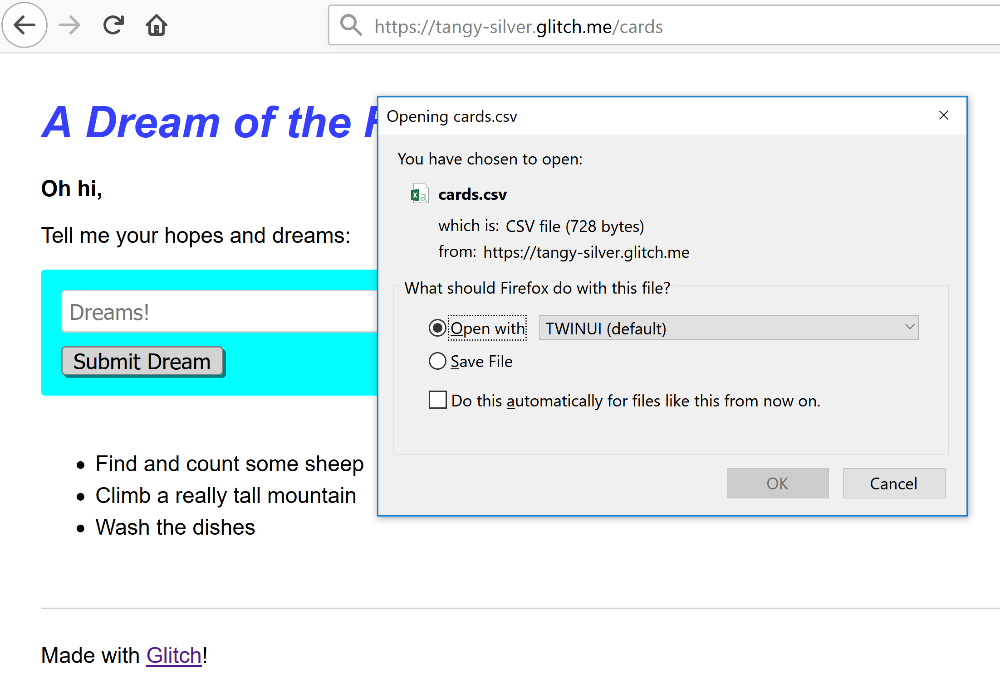

[Glitch](glitch.com) is an online environment for creating and sharing web applications. It's like codepen, but with a node.js server side environment. 

> [My Spaced Repetition Flash Card Export ported to Glitch](https://glitch.com/edit/#!/tangy-silver?path=server.js:15:21)

For easy creation, rapid prototyping and simple experiments it is a wonderful resource. 

As you may know, I have a [Weird Obsession with Markdown and Spaced Repetition](https://withouttheloop.com/articles/2018-10-02-my-weird-obsession-with-markdown-and-spaced/), that led to me creating a system for embedding flash card data into my markdown notes, and using the github API to extract the data and build a CSV for importing into Anki (a program for studying spaced repetition flash cards). 

The workflow then is:

* write my study note, including flash card data for the things that I would like to memorize
* go to codepen to run my extract 
* copy the CSV from the browser console
* save the CSV to a file
* import the file into Anki

I don't have to do it often, but even so this is an intimidating workflow. By moving the extract from codepen to glitch I can learn a little about glitch and improve the workflow to: 

* write my study note, including flash card data for the things that I would like to memorize
* go to glitch to run my extract and download a CSV file
* import the file into Anki

Moving to Glitch
----------------

After logging into Glitch I created a new project. This provides a working node.js application (I chose to use the Express MVC framework) complete with static file serving and client side code (which I don't need).

Porting my client-side code from codepen to server side code running on node.js broke a number of things. Firstly, I used the [fetch API](https://developer.mozilla.org/en-US/docs/Web/API/Fetch_API) to make HTTP requests, and this API is not available in a node.js environment. This can be fixed using the `node-fetch` npm module.

To add an npm module to a glitch project, simply add the dependency to the `package.json` file. I needed a number of dependencies:

```json
"dependencies": {
    "express": "^4.16.3",
    "papaparse": "*",
    "node-fetch": "*",
    "atob": "*"
  },
```

The second uncertainty I encountered was how to factor my application into multiple modules and files. I started by implementing the application in a single file `server.js` and making sure that it worked. Then I moved some code for parsing the micro format into a file (`cards.js`) and the code for working with the github API into a file (`github.js`). Importing those modules into another module is done the same way as any other node.js application:

```javascript
const github = require('./github');
```

Now I can access my application at https://tangy-silver.glitch.me/cards and download the latest CSV of flash card data.



To spin up a quick, hosted node.js application with the minimal friction, try [Glitch](glitch.com). 