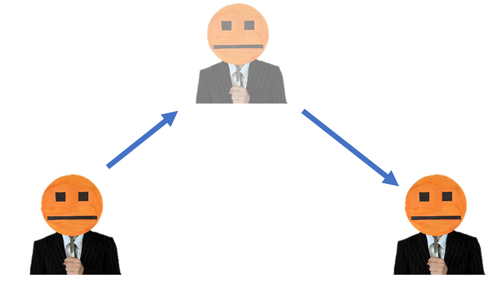

Feedback should be DIRECT. Provide feedback immediately, consistently, and to the subject of the feedback. This is often not what happens.

Triangular Feedback
------------------

Most people, myself included, would rather pull their fingernails off than give someone critical feedback. Yet feedback is an essential tool, especially for leaders. It is necessary because:

* high performers, especially those motivated by the need for achievement, are hungry for feedback as a tool for self-awareness and self-improvement
* without feedback you may set expectations but they will be ignored. Feedback is the tool by which we demonstrate that we mean what we say.
* feedback accelerates learning. It improves the performance of individuals and teams. 

We know we should give feedback, but we hate it, so often we give feedback to a third party, "hey Alice, Bob has been writing a lot of insecure software lately". This is called Triangular feedback, the intention being that Alice should pass on the feedback to Bob. Unfortunately, this is just gossip. Bob's reputation is tarnished and he is unable to defend himself. The person most able to improve Bob's performance is Bob, so that is who needs to receive the feedback. 

*The feedback triangle*

[Tversky and Kahneman](https://en.wikipedia.org/wiki/Attribute_substitution#History) proposed a family of cognitive biases that reduce the effort of decision making by replacing (substituting) a hard question with an easy question. For example, in 1899 when required to chose a leader the American voters elected President Harding, "whose only qualification for the position was that he perfectly looked the part" (Kahneman, 2011). They replaced a hard question (who would be the best leader), with an easier one (who looks strong and decisive). So it is with feedback that we replace the hard thing (giving a person feedback that they may not like) with an easier thing (gossiping to a third-party). Unfortunately, the value of feedback is lost and the harmful side-effects of gossip are introduced.  

*Strong and decisive?*

Linear Feedback
---------------

Either give feedback directly to the subject, or keep it to yourself. 

Linear feedback is my personal rule, and a virus I'd like to spread, that I won't be involved in triangular feedback. If someone comes to me with feedback about someone else, I ask them to give the feedback directly. I also do not enjoy being the subject of triangular feedback. When it happens I suggest that the commentor bring their concerns to me directly. 

*Linear feedback*

Feedback triangles are pervasive and unproductive. Let's do better. 